## Part 1. Установка ОС

  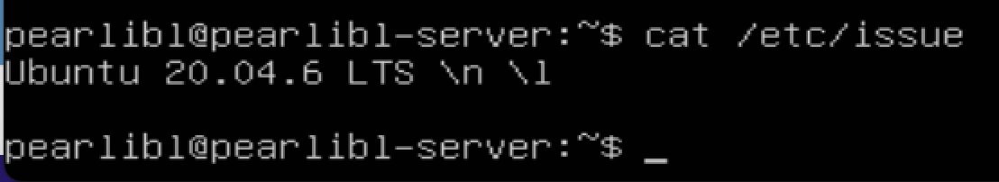

## Part 2. Создание пользователя

Создание нового пользователя: 

  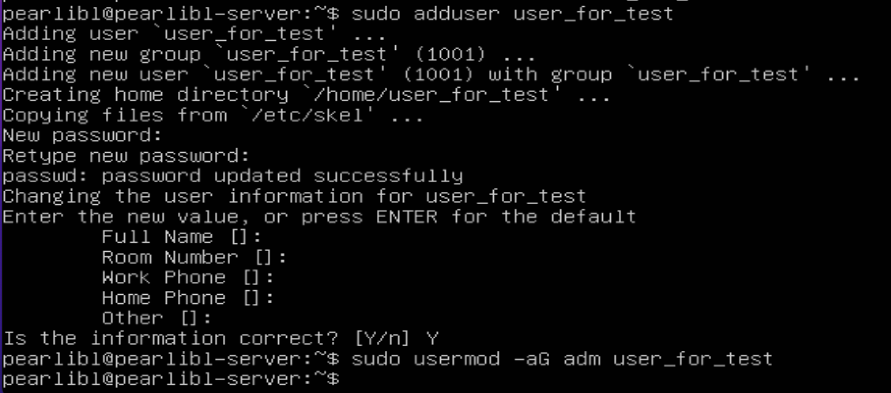

  Подтверждение его наличия в группе adm: 

  

## Part 3. Настройка сети ОС

- Задаём название машины user-1(команда `sudo hostnamectl set-hostname user-1`). Изменения вступят в силу послед перезагрузки или при сипользовании комнады `exec bash`. Проверить имя хоста можно командой `hostnamectl`: 

  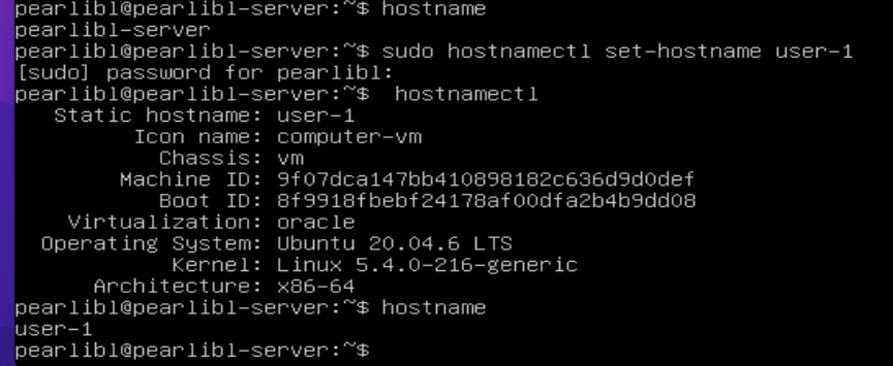

- Установим временную зону, соответствующую текущему местоположению. Используем команду `sudo timedatectl set-timezone Europe/Moscow` для внесения изменений и 
`timedatectl` для их проверки. В результате получаем: 

  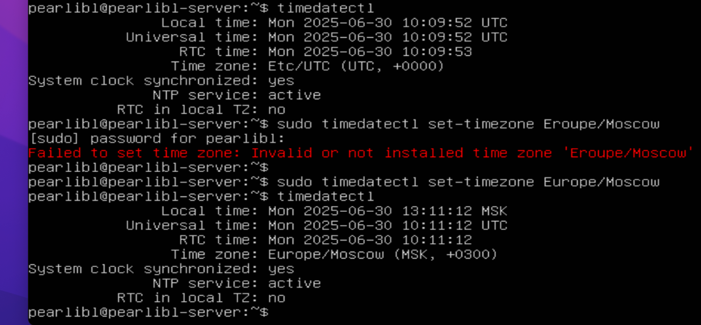

- Выведем названия сетевых интерфейсов с помощью консольной команды `ip link show`: 

  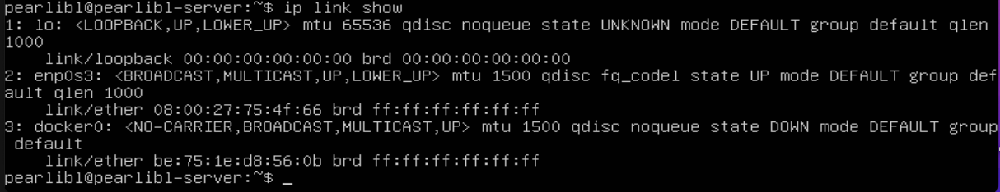

 Интерфейс `lo` (loopback) — это стандартный виртуальный сетевой интерфейс в Linux, использующий IP-адрес `127.0.0.1` для локальной коммуникации внутри системы. Он предоставляет устройству механизм взаимодействия с самим собой через сетевые протоколы, позволяя программам обмениваться данными внутри одной системы, как если бы они работали в сети (например, веб-сервер и браузер на одном ПК). Это необходимо для тестирования сервисов (веб-серверов, БД) без внешнего подключения, работы системных процессов и обеспечения совместимости с сетевыми стандартами. Интерфейс lo является обязательным компонентом сетевого стека ОС, даже в виртуальных средах, а его наличие в выводе ip a подтверждает корректность базовой сетевой конфигурации.

- Используя консольную команду `ip address show` или его сокращённую форму `ip a`, получим ip адрес устройства, на котором я работая, от DHCP-сервера: 

  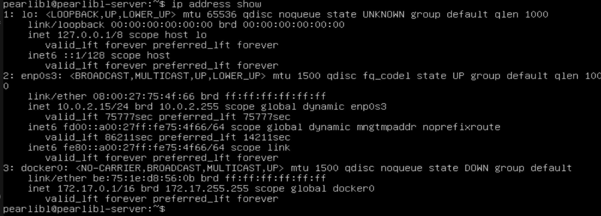

  DHCP (Dynamic Host Configuration Protocol) — это протокол, автоматически назначающий устройствам IP-адреса и сетевые параметры (маску, шлюз, DNS), исключая ручную настройку. Работает по принципу DORA: устройство отправляет широковещательный запрос (DISCOVER), сервер предлагает свободный IP (OFFER), устройство подтверждает запрос (REQUEST), а сервер фиксирует аренду (ACK). DHCP используется в домашних роутерах, офисных сетях и виртуальных машинах, экономя время и предотвращая конфликты IP. Недостатки — зависимость от сервера и изменение адресов (не подходит для серверов). Проверить DHCP в Linux можно через ip a (метка "dynamic") или файл аренды /var/lib/dhcp/dhclient.leases. Если DHCP недоступен, IP настраивается вручную командой ip addr add. По сути, DHCP — это "гардеробная система" для IP-адресов: выдаёт, отслеживает и освобождает их автоматически.

- Определим и выведем на экран внешний ip-адрес шлюза (ip) и внутренний IP-адрес шлюза, он же ip-адрес по умолчанию (gw). Для этого используем команду `ip route show default | awk '/default/ {print $3}'` для получения адреса по умолчанию и команду `curl ifconfig.me` - для внешнего. В результате получаем: 

  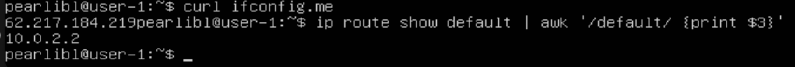

- Чтобы задать статичные (заданные вручную, а не полученные от DHCP-сервера) настройки ip, gw, dns откроем кофиг файл `00-installer-config.yaml` в редакторе нано(`sudo nano /etc/netplan/00-installer-config.yaml`) и введём параметры представленные ниже на скрине, после чего командой `sudo netplan apply` убедимся в корректности файла и применим изменения: 

  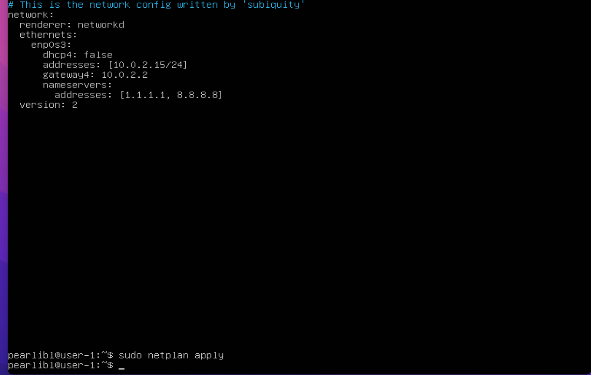

- Поесле перезагрузки ВМ пропингуем адреса 1.1.1.1 и ya.ru (`ping -c 5 ...`): 

  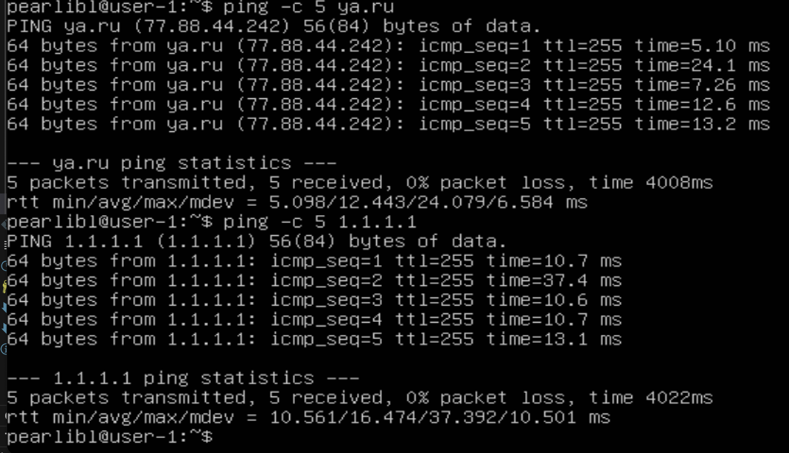

  Как мы видим на скрине - `«0% packet loss»` в обоих случаях.

## Part 4. Обновление ОС

- Обновим системные пакеты до последней на момент выполнения задания версии. Сначала узнаем какие из пакетов имеют обнавления командой `sudo apt update` и получив их метаданные установим их на локальную машину командой `sudo apt upgrade`. Убедимся что наша ос имеет самые актуальные обновления повторным вызовом команды `sudo apt update`: 

  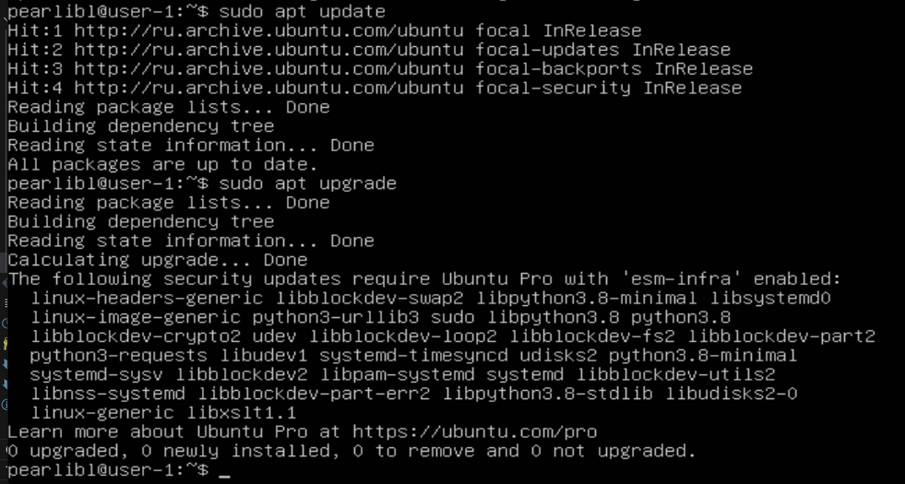

  как видим - `"All packages are up to date"`.

## Part 5. Использование команды **sudo**

-  `sudo` (от англ. SuperUser DO) — это команда, которая позволяет выполнять действия с правами администратора (root) в Linux и macOS. Разрешим пользователю, созданному в [Part 2](#part-2-создание-пользователя) выполнять команду sudo. Пропишем `sudo adduser user_for_test sudo`. 

  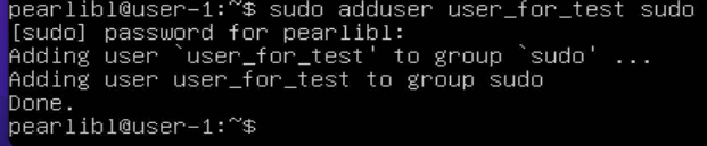

- Поменяем hostname ОС от имени пользователя, созданного в пункте [Part 2](#part-2-создание-пользователя) (используя `sudo`). Сначала меняем пользователя, затем имя: 

  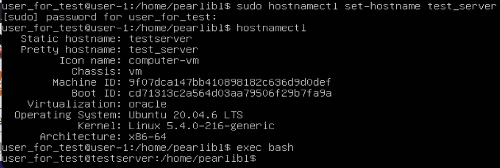

## Part 6. Установка и настройка службы времени

- Выведем время актуального часового пояса
- Убедимся, что вывод следующей команды должен содержать `NTPSynchronized=yes`

  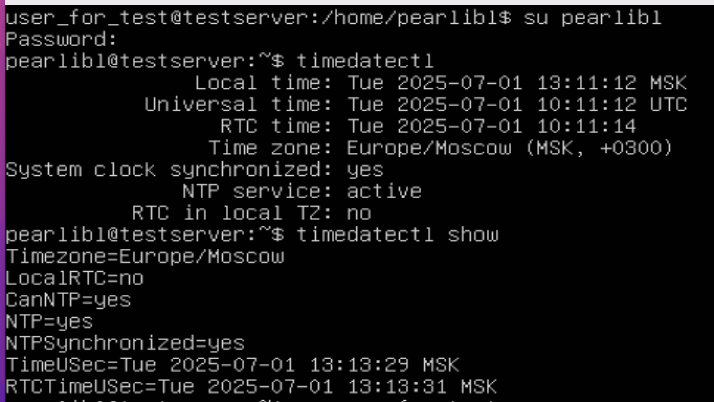

## Part 7. Установка и использование текстовых редакторов 

 - Для этого задания я использовал редакторы Vim, Nano и Joe. Создадим по тестовому файлу для каждого из редакторов: 

   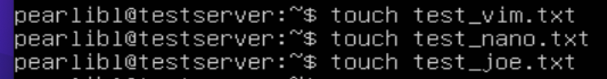

- Начинаем с редактора Vim. `vim test_vim.txt` откроет нужный нам файл в редакторе. Затем переходим в режим `insert` нажав букву I. Введя текст нажмём `esc` а затем `:wq`, чтобы выйти из редактора с сохранением изменений: 

   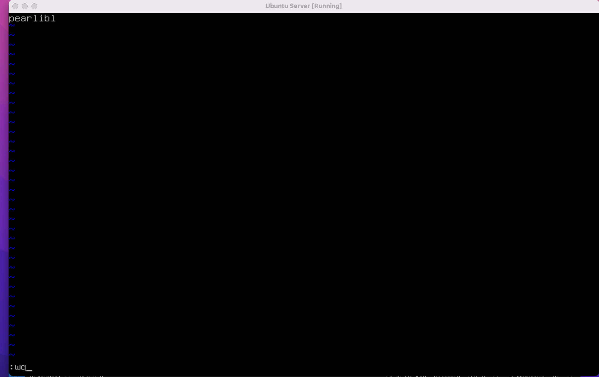
- Теперь воспользуемся редактором Nano. `nano test_nano.txt`. Здесь для сохранения измений в файле нужно нажать комбинацию клавиш `ctrl+x`, затем подвердить намерние нажав клавишу `Y` и затем `Enter`: 

   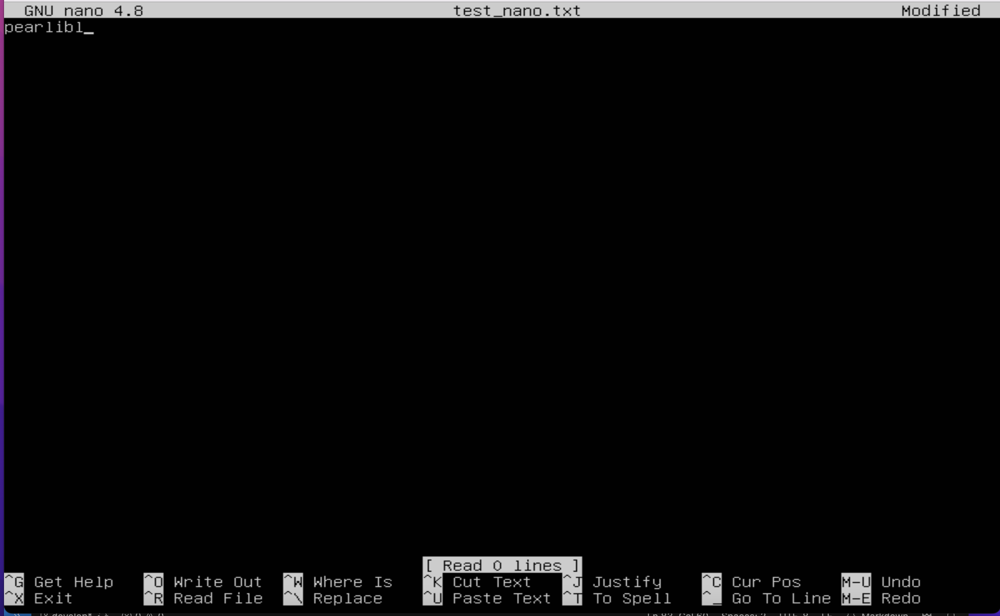

- Ну и наконец пропишем `joe test_joe.txt`. Чтобы выйти с сохранением изменений нажимаем `ctrl+k` а затем `x`: 

   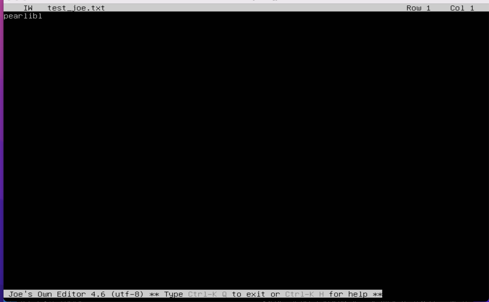
##### Теперь, используя каждый из трех выбранных редакторов, откроем файл на редактирование, отредактируем файл, заменив никнейм на строку «21 School 21», закрыв файл без сохранения изменений.

-  `VIM`: 

   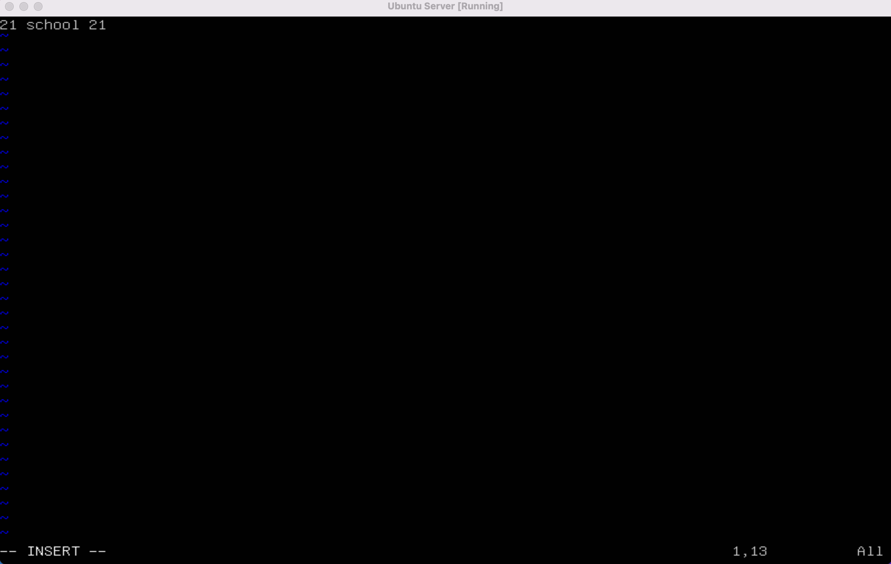

  Для выхода без измененй нажимаем `esc` а затем `:q!` и  `Enter`.

-  `NANO`: 

   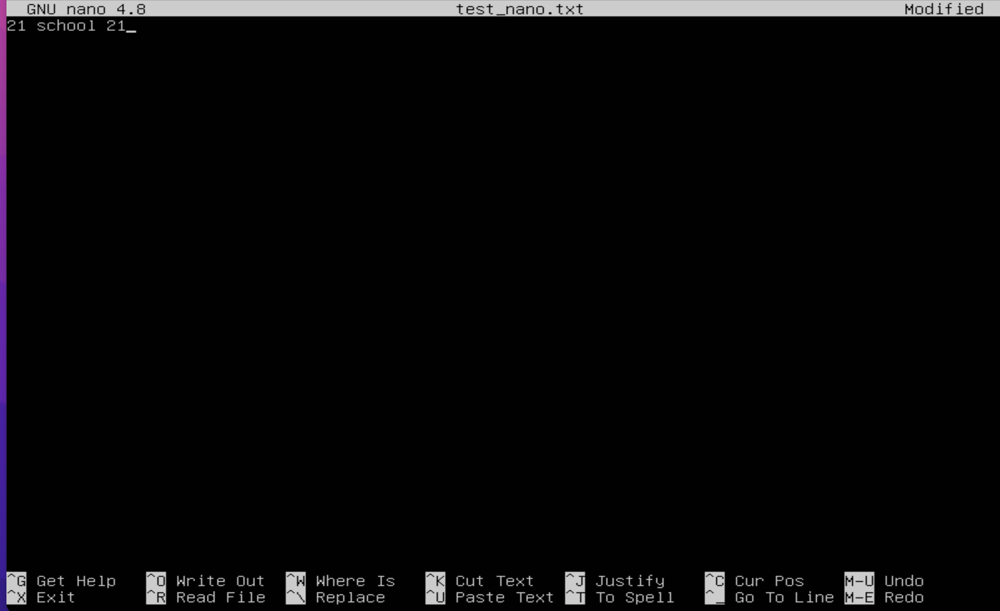
  Так же нажмём  комбинацию клавиш `ctrl+x`, но выберем `N` и затем `Enter`, чтобы изменения не сохранились:
  
-  `JOE`: 

   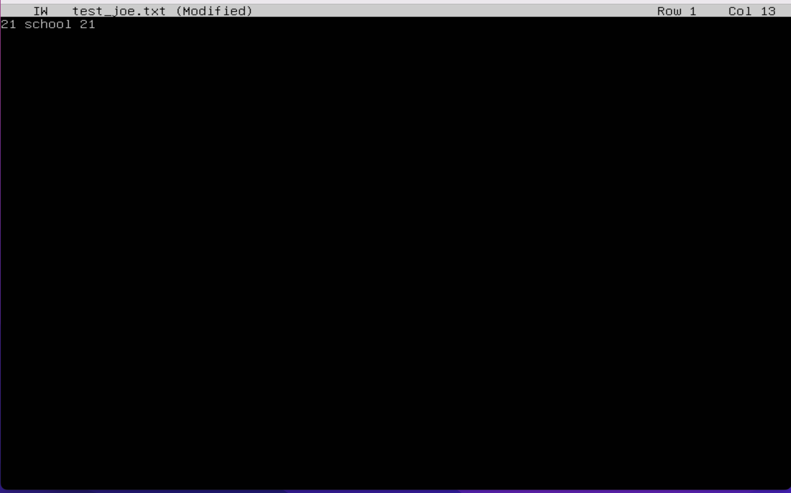

  Нажмём  комбинацию клавиш `ctrl+c`, затем подвердим желание выйти без сохранения изменений нажам на `y`;

##### Используя каждый из трех выбранных редакторов, отредактируем файл ещё раз (по аналогии с предыдущим пунктом), а затем освой функции поиска по содержимому файла (слово) и замены слова на любое другое.

-  `VIM`: 

  Для поиска нажимаем `/` а затем вводим строку, которую хотим найти в файле: 

   
 
  Для глобальной замены прописываем `:%s/старое/новое/g` : 

   

-  `NANO`: 

  Для поиска нажимаем  `ctrl+w`, затем строку для поиска и `Enter`:

   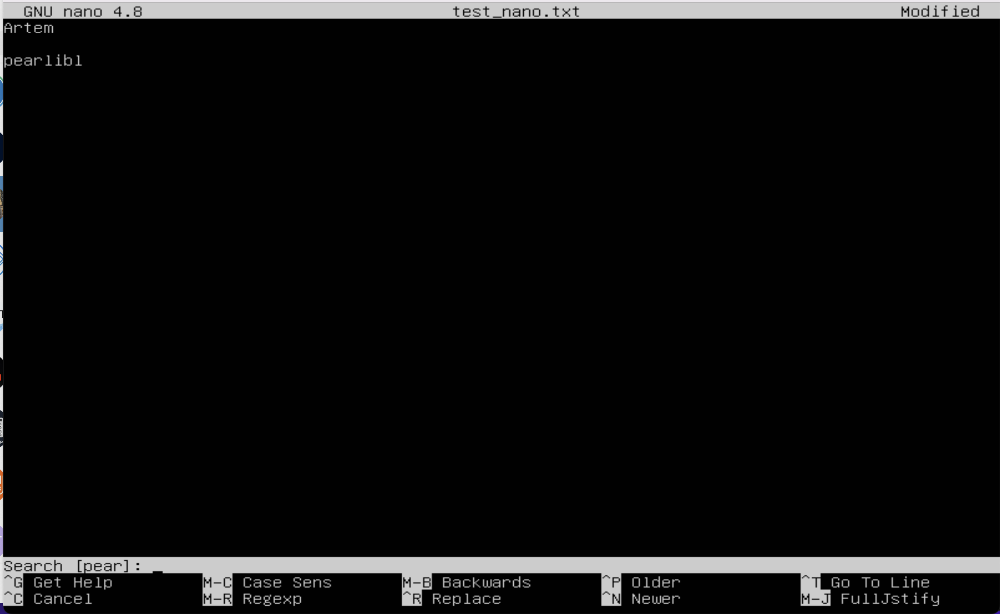

  Для замены нажимаем  `ctrl+\`, вводим строку , которую хотим заменить, на что хотим заменить. Далее можно выбрать замену конкретной строки (`Y/N`) или всех совпадений `A`:

  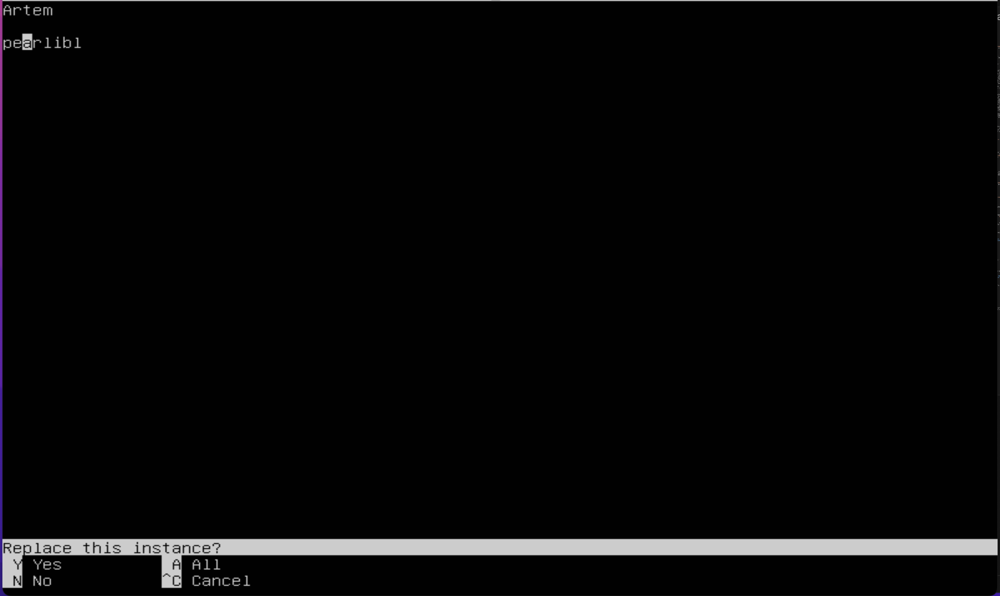

-  `JOE`: 

  Для поиска нажимаем  `ctrl+k`, затем `F`, строку для поиска и `Enter`. Важно, что поиск начнётся от положения курсора.  

   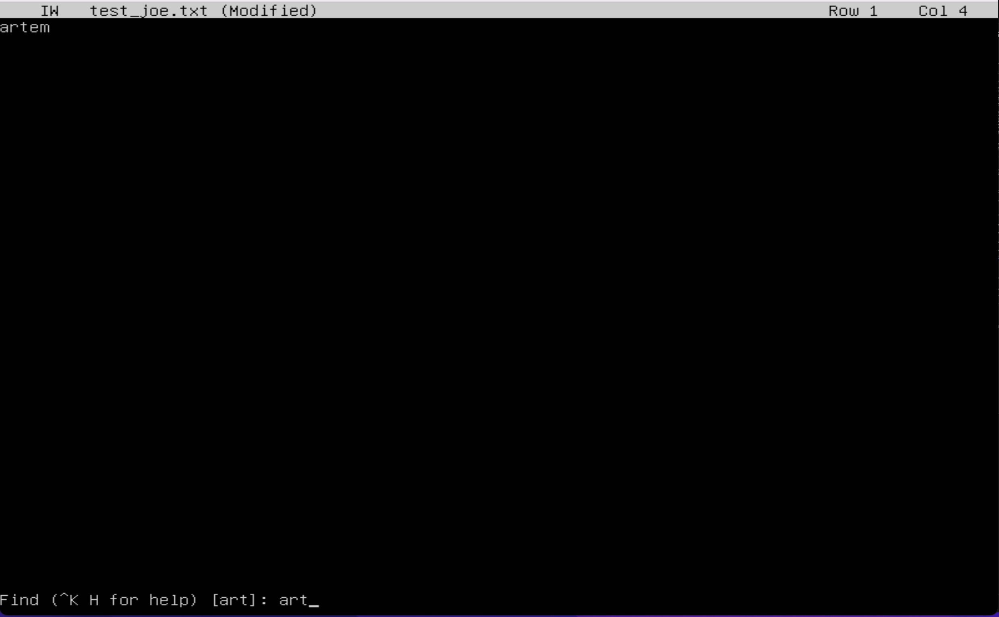

  Для замены нажимаем  `ctrl+k`, затем `F` , строку для поиска и `R`. Затем на что мы хотим её заменить и подтверждаем операцию (или нет) `Y/N/R/B`. 
  
   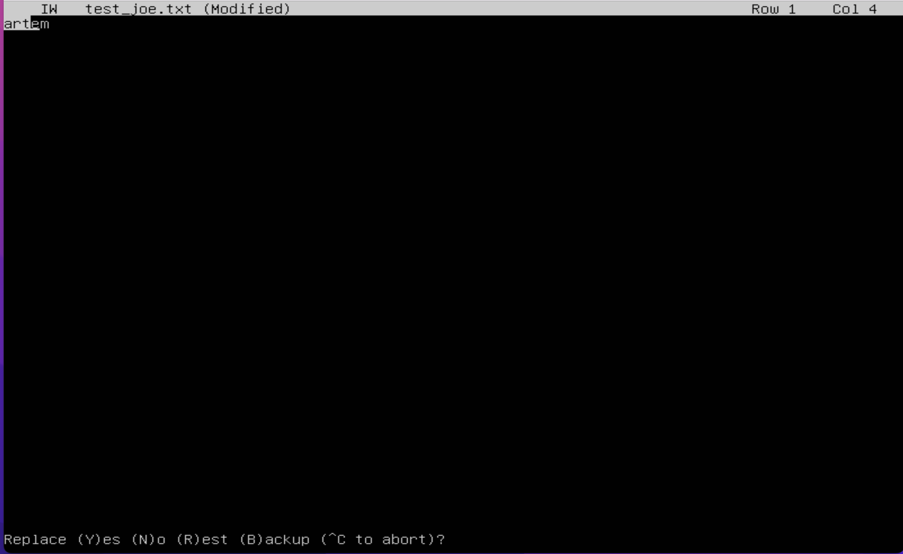

  В обоих случаях для прекращения текущей операции можно нажать комбинацию `ctrl+c`.

## Part 8. Установка и базовая настройка сервиса **SSHD**

- Для установки `SSHd` пропишем `sudo apt install openssh-server`.  Перезагрузим систему командой `sytemctl reboot` и затем прописываем `sytemctl status ssh` для проверки статуса работы службы: 

    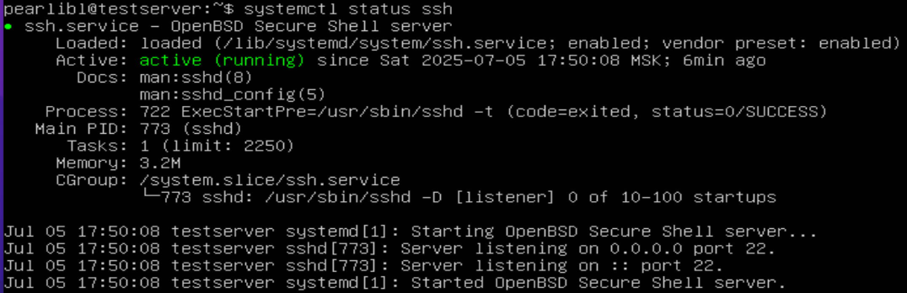

- Даже после перезагрузки система находится в режиме `active`, но на всякий случай убедимся, что автозапуск включен командой `systemctl is-enabled ssh` 

   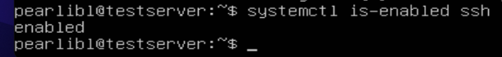

    Как видим - статус `enabled`, а значит всё как нам и было нужно.

- Перенастроим службу SSHd на порт 2022.
   Для этого внесём изменения в конфигаруционный файл  `/etc/ssh/sshd_config`. Находим строку `#Port22` и запишем вместо неё наше значение(`Port 2022`).

   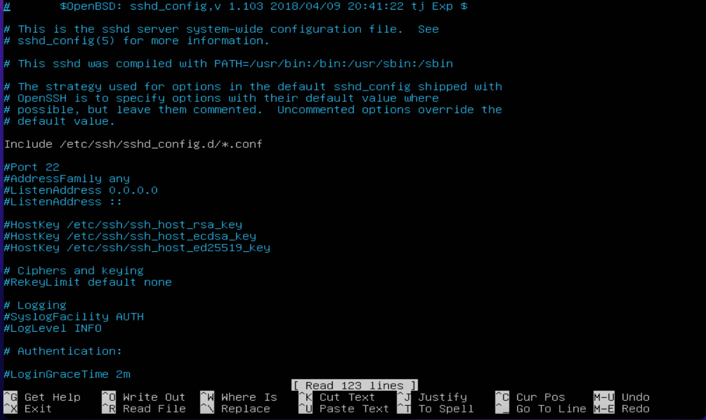

- Перезапустим службу комндой `systemctl restart ssh` и вновь проверим вступили ли изменения в силу командой `sytemctl status ssh`. Как видим теперь зайдествован порт 2022: 

   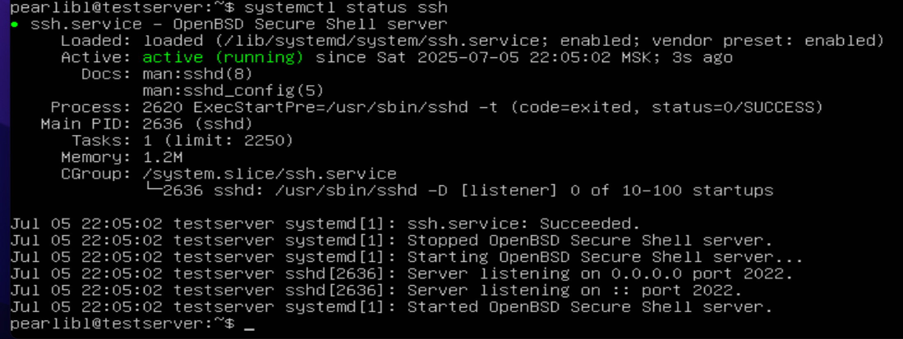

- Используя команду `ps`, покажем наличие процесса `sshd`. `ps (process status)` - показывает информацию о запущенных процессах в системе. К ней нужно добавить следующие флаги:
    - `a`: процессы всех пользователей (не только текущего)
    - `u`: детализированный вывод (с пользователем и потреблением ресурсов)
    - `x`: включить фоновые процессы (демоны)
  Так же добавим `grep sshd` чтобы вывести только интересющие нас строки. Итоговая команда `ps aux | grep sshd` даёт нам следующий результат: 

   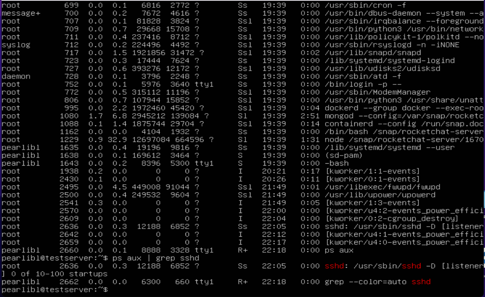
- Финальный тест: перезагрузим систему и пропишем команду  `netstat -tan`(я так же добавил уточнение `grep 2022` чтобы избавиться от лишних строк в выводе), предварительно её установив(`sudo apt install net-tools`). Получим: 

   

   где столбцы имеют следующие значения:
    - 1) Протокол, используемый для подключения (например, TCP или UDP)
    - 2) объём полученных данных, ожидающих обработки, в байтах.
    - 3) объём данных, ожидающих отправки, в байтах.
    - 4) IP-адрес и номер порта локальной конечной точки соединения.
    - 5) IP-адрес и номер порта удалённой конечной точки соединения.
    - 6) Текущее состояние подключения (например, LISTEN, ESTABLISHED, TIME_WAIT, и т. д.).

    Сама же утилита `netstat` служит для отображения информации о сетевых подключениях системы, а импользованные флаги предназначены для:
    - `t`: отображения всех TCP-соединений.
    - `a`: отображения как прослушиваемых, так и непрослушиваемых (установленных) соединения.
    - `n`: отображения числовых адреса (IP-адреса и номера портов), а не их доменных имен или имен служб.

    Значение 0.0.0.0 в 4-м столбце указывает на то, что соединение прослушивается на всех доступных сетевых интерфейсах (то есть на всех IP-адресах, назначенных системе) и на всех доступных портах. Это так называемый адрес с подстановочным знаком, который означает, что соединение принимает входящие подключения с любого IP-адреса. В нашем случае SSH-сервер прослушивает все доступные сетевые интерфейсы на порту 2022.

## Part 9. Установка и использование утилит **top**, **htop**

  - Установим и запусти утилиты top и htop. Т.к. в моём случае утилиты были установлены, то сразу перейдём к их использованию!

  ## TOP

    - uptime: 59 min
    - количество авторизованных пользователей: 1 user
    - средняя загрузка системы: 0.00 (1 min), 0.01 (5 min), 0.00 (15 min)
    - общее количество процессов: 114
    - загрузка cpu: 0.3%
    - загрузка памяти: Память процессов  `(RES)` = 56.3/1971.3 MiB (увидим после нажатия клавиши `m`),
      `used` = 944/1971.3 MiB, `buff/cache` = 947.7 MiB(кторую мы можем быстро освободить)
    - pid процесса занимающего больше всего памяти: 1219 (`shift+m`)
    - pid процесса, занимающего больше всего процессорного времени: 1080 (`shift+t`)

  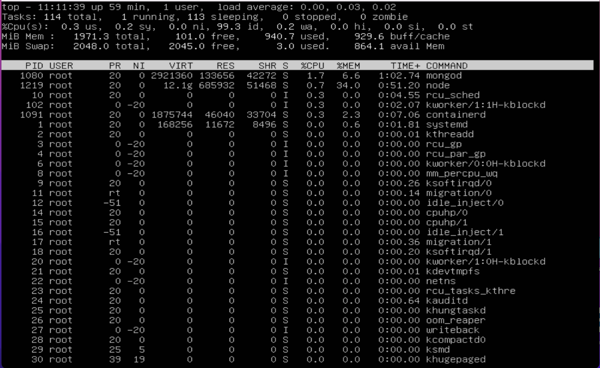

  ## HTOP

    - скрин с выводом команды htop отсортированному по PID:

  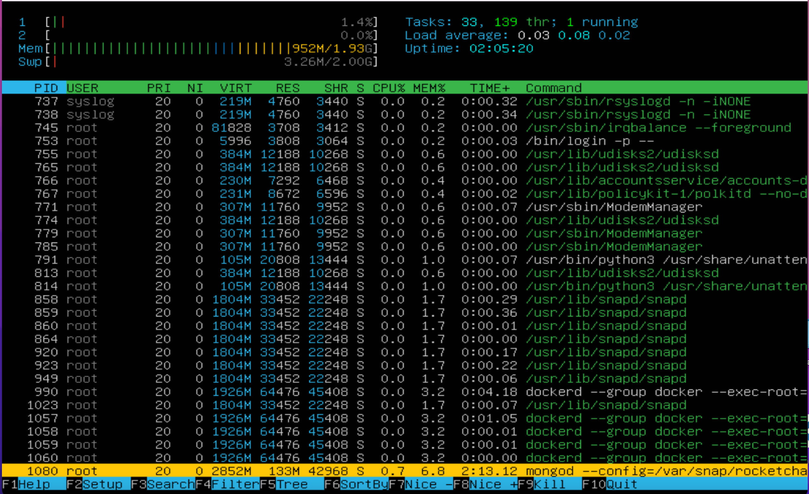

    - скрин с выводом команды htop отсортированному по PERCENT_CPU:

  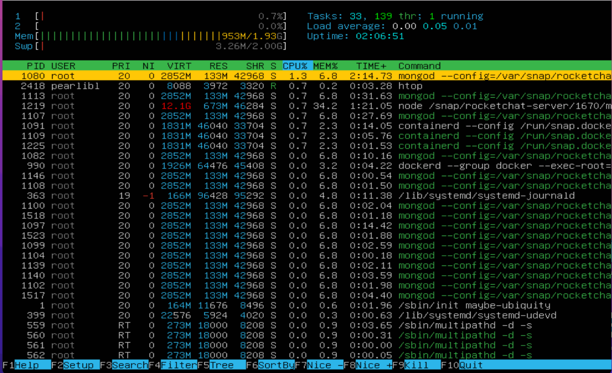

    - скрин с выводом команды htop отсортированному по PERCENT_MEM:

  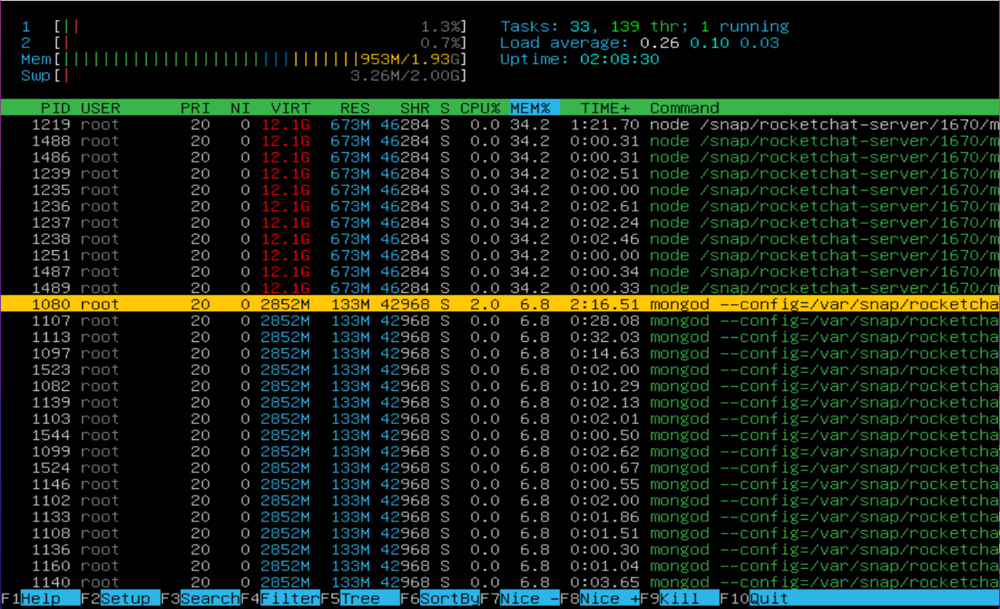

    - скрин с выводом команды htop отсортированному по TIME:

  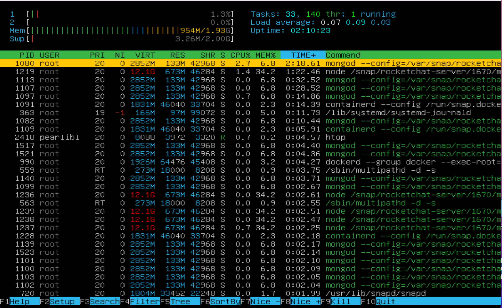

    - скрин с выводом команды htop отфильтрованному для процесса sshd;

  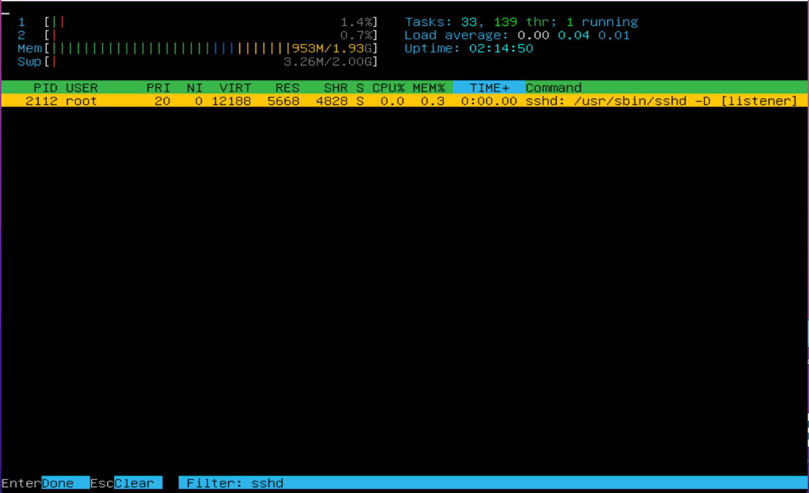

    - скрин с выводом команды htop с процессом syslog, найденным, используя поиск;

  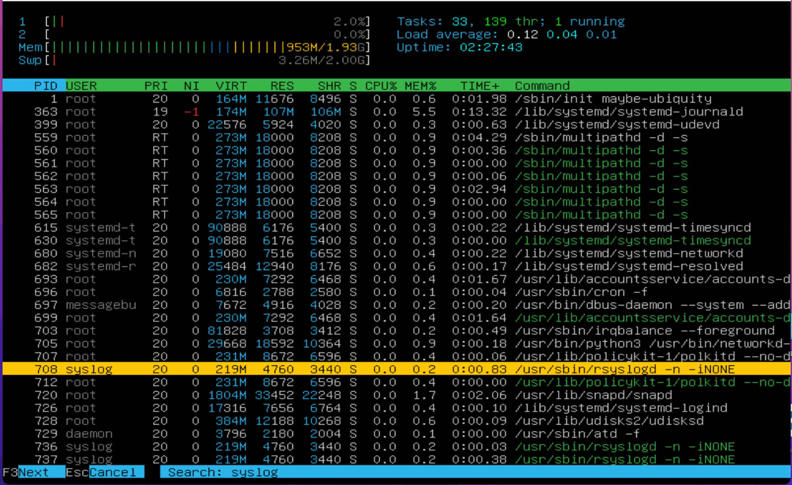

    - скрин с выводом команды htop с добавленным выводом hostname, clock и uptime:

  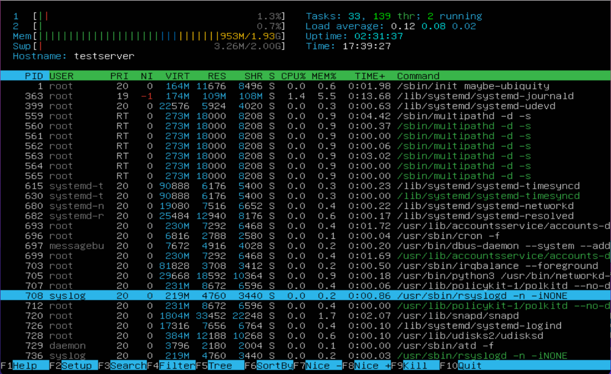

## Part 10. Использование утилиты **fdisk**

  Запустим команду fdisk -l и проанализируем полученный вывод:
  - Название жёсткого диска: VBOX HARDDISK.
  - Размер: 25 GiB.
  - Количество секторов: 52428800.
  - Размер swap(резервное пространство на диске, куда система перемещает неиспользуемые данные из RAM,
    чтобы освободить место для активных процессов): 26843545600 bytes.

      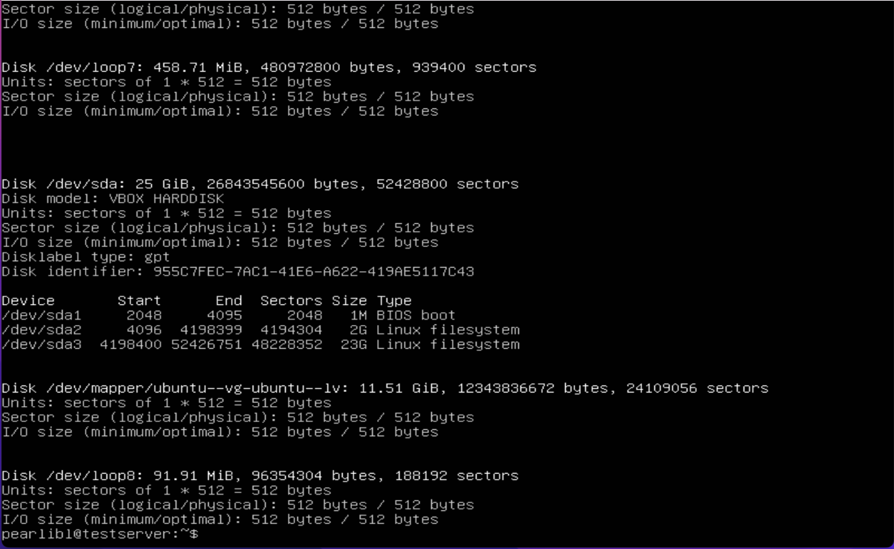

## Part 11. Использование утилиты **df** 

##### Запустим команду df для корневого раздела (/):

  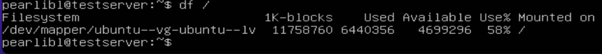

  - размер раздела: 11758760
  - размер занятого пространства: 6440356
  - размер свободного пространства: 4699296
  - процент использования: 58%

  Размеры отображаются в блоках (по умолчанию 1 блок = 1024 байта). Если система настроена на вывод в байтах, мы увидим точные числа (например, 536870912 вместо 512M).

##### Теперь запустим команду df -Th для корневого раздела (/):

  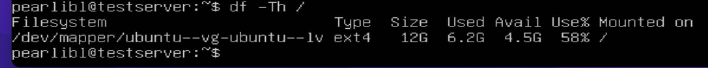

  - размер раздела: 12G
  - размер занятого пространства: 6.2G
  - размер свободного пространства: 4.5G
  - процент использования: 58%

  -h (--human-readable) преобразует размеры в удобные единицы (ГБ, МБ и т.д.).
  -T добавляет колонку Type с типом файловой системы(В нашем случае `ext4`).

## Part 12. Использование утилиты **du**

##### Запустим команду du.

  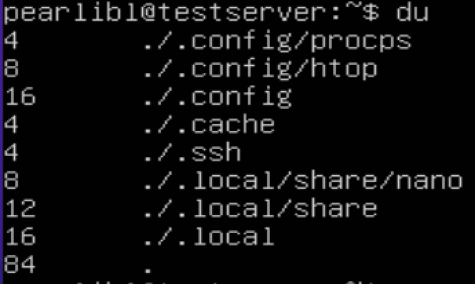

##### Выведем размер папок /home, /var, /var/log (в байтах, в человекочитаемом виде).
  Для этого используем флаги:
  - s — показывает только итог (без вложенных папок).
  - h — читаемый формат.
  - b — расчёт в байтах.
  
  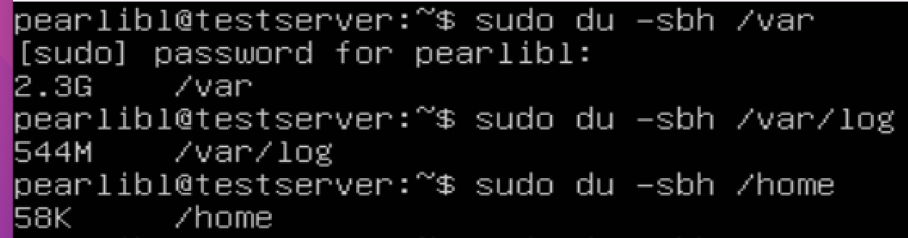

##### Выведем размер всего содержимого в /var/log (не общее, а каждого вложенного элемента, используя *).

  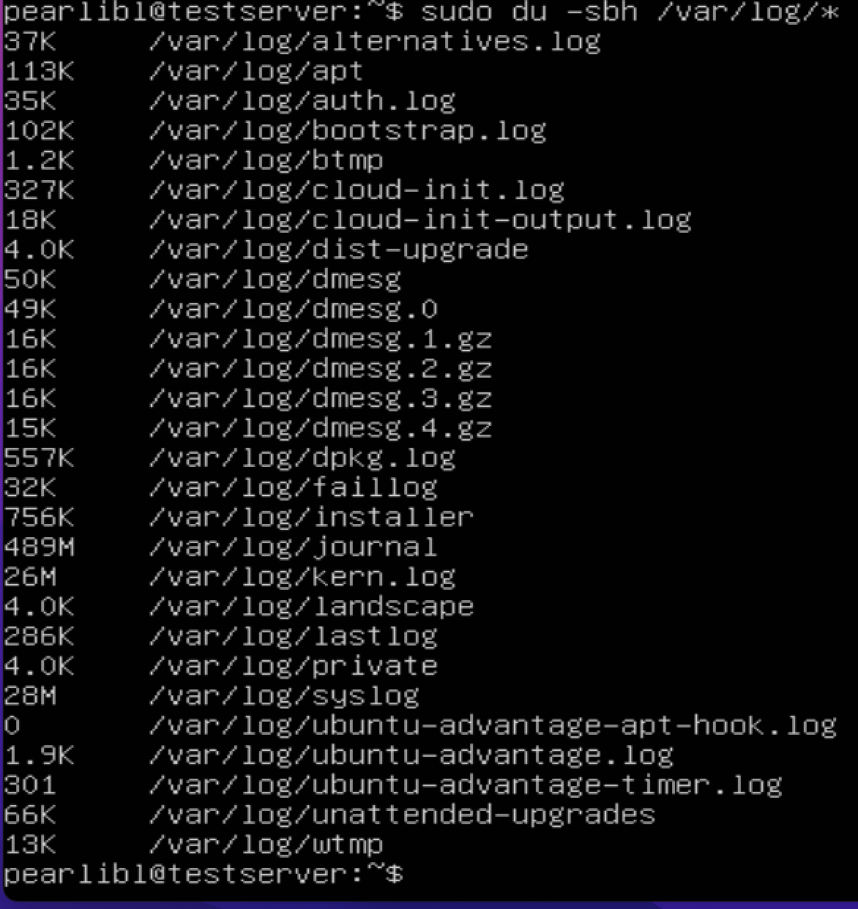

## Part 13. Установка и использование утилиты **ncdu**
 Установим утилиту ncdu (`sudo apt-get install ncdu`).
##### Выведем размеры папок /home, /var, /var/log.
  Пропишем команду `sudo ncdu /` для получения информации о содержимом корневой папки. Далее, зайдя в утилиту, можно, используя стрелки длля навигации, выбрать интересующие нас папки. Нажав на ней клавишу `i` мы получим небольшую сводку, а нажав на `enter` мы можем в неё зайти.

HOME:

  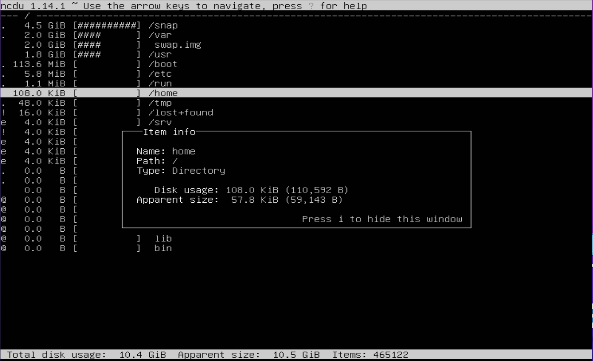

VAR:

  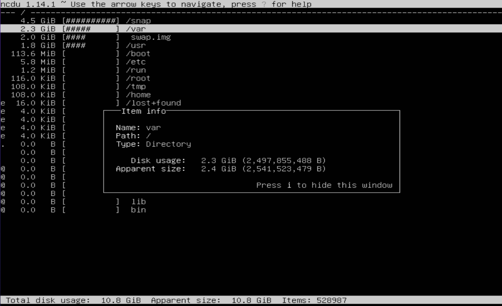

VAR/LOG:

  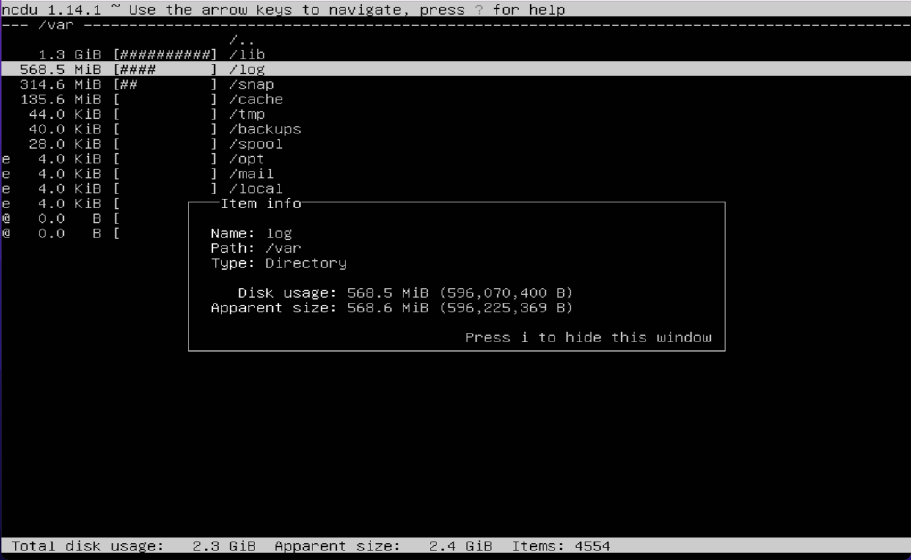

## Part 14. Работа с системными журналами

##### Откроем для просмотра: /var/log/dmesg, /var/log/syslog, /var/log/auth.log

  Для этого можно воспользоваться любым удобным для нас редактором.

  Для получения информации о времени последней успешной авторизации, имени пользователя и методу входа в систему я прописал команду поиска   `sudo grep "session opened" /var/log/auth.log | tail -n 1` чтобы в файле `/var/log/auth.log` найти строку  "session opened" а команда  `tail -n 1` выведет последнее совпадение.

  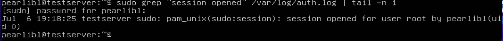

  Как видим, время последней успешной авторизации 6 июля 19:18:25, имя пользователя pearlibl, а метод входа - `pam_unix`(стандартная аутентификация через пароль) через `sudo`.

  Теперь перезапустим службу SSHd, выполнив команду `sudo service ssh restart`.
  Как видно на скиншоте ![part14-2] дата последнего изменения полученного командой `sudo grep "sshd.*Restarting" /var/log/auth.log | tail -n 1` совпадает с датой на моём пк, значит задание выполнено.

  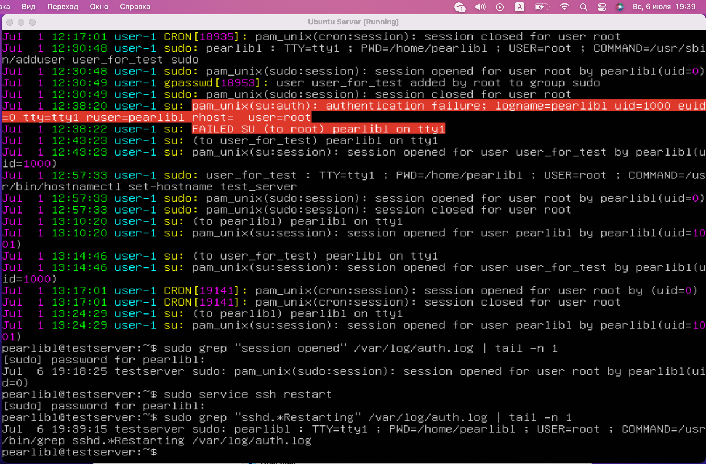

## Part 15. Использование планировщика заданий **CRON**

 - Используя планировщик заданий, запустим команду uptime через каждые 2 минуты. Для этого пропишем в терминале `sudo crontab -e`, выберем редактор (в моём случае `nano`). Добавим в открывшийся файл строку `*/2 * * * * /usr/bin/uptime >> /var/log/uptime.log`, где `*/2 * * * *` - это расписание( после двойки идут разярды часов, дней, месяцев и последний - каждый день недели), а дальше мы просто перенаправляем вывод команды `/usr/bin/uptime` в файл `/var/log/uptime.log`(если вдруг файл не создался сам, то это можно сделать в ручную и дать ему права `chmod 644`).

  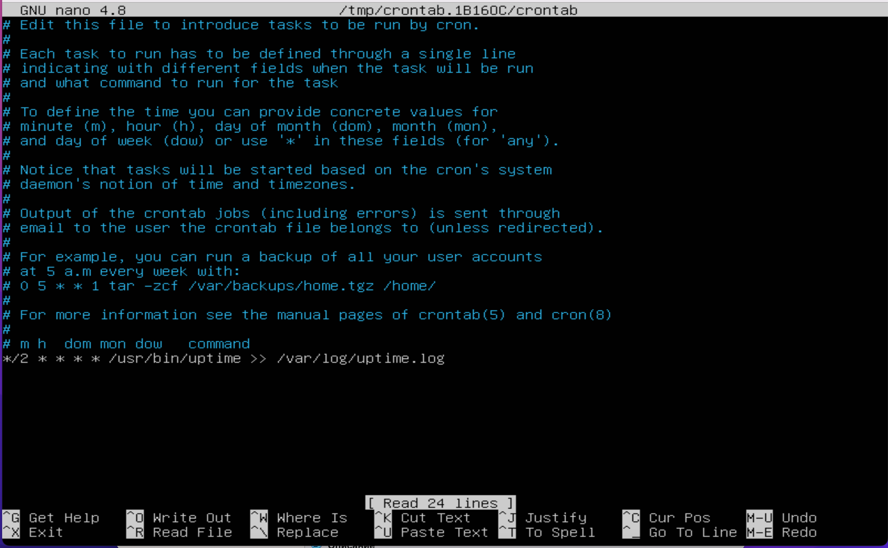

 - Чтобы вывести список задач на нужно ввести команду `sudo cron -l`

   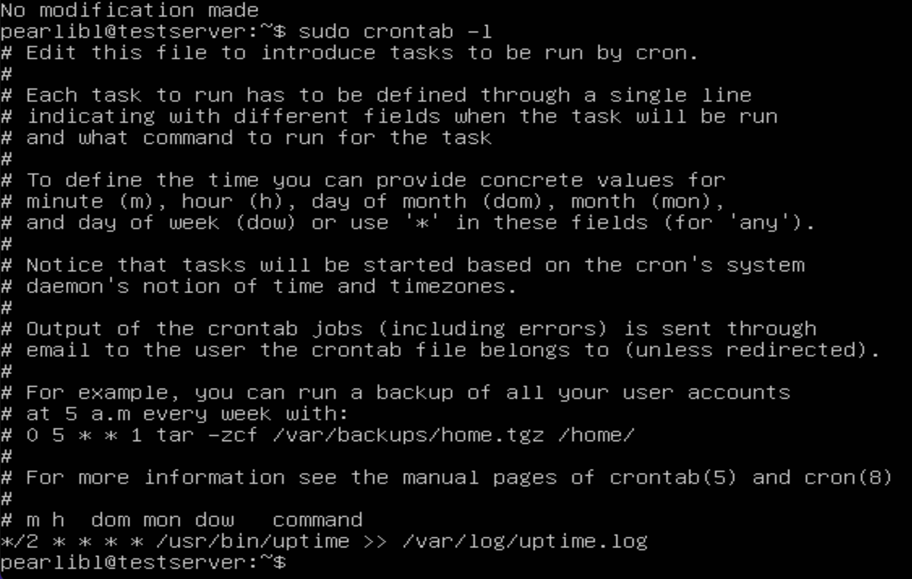

 - Спустя некоторое время открываем наш файл для логов и смотрим, пояивились ли там записи:

  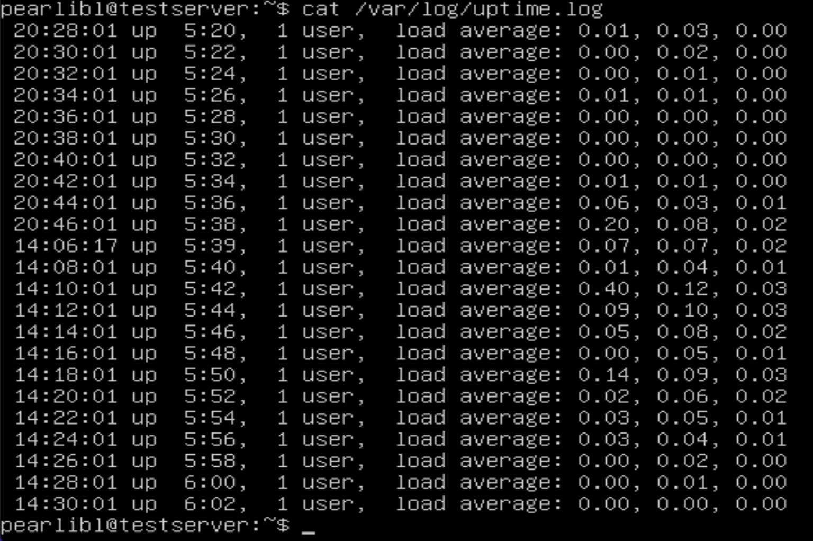

  Да, все выводы записываются в наш файл каждые 2 минуты.
  
 - Теперь удалим задачи командой `sudo cron -r` и убедимся, что операция прошла успешно повторным выводом `sudo cron -l`:

  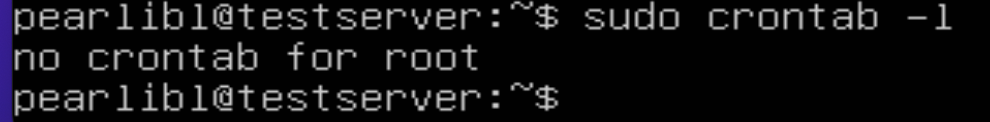

