## Contents

3. [Chapter III](#chapter-iii) \
   3.1. [Инструмент ipcalc](#part-1-инструмент-ipcalc) \
   3.2. [Статическая маршрутизация между двумя машинами](#part-2-статическая-маршрутизация-между-двумя-машинами) \
   3.3. [Утилита iperf3](#part-3-утилита-iperf3) \
   3.4. [Сетевой экран](#part-4-сетевой-экран) \
   3.5. [Статическая маршрутизация сети](#part-5-статическая-маршрутизация-сети) \
   3.6. [Динамическая настройка IP с помощью DHCP](#part-6-динамическая-настройка-ip-с-помощью-dhcp) \
   3.7. [NAT](#part-7-nat) \
   3.8. [Допополнительно. Знакомство с SSH Tunnels](#part-8-дополнительно-знакомство-с-ssh-tunnels)

## Part 1. Инструмент **ipcalc**
Поднимем виртуальную машину (далее -- ws1)

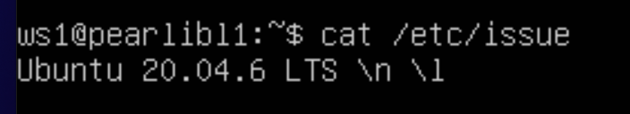

#### 1.1. Сети и маски

 1) Получим адрес сети *192.167.38.54/13* при помощи команды `ipcalc 192.167.38.54/13`
    

 2) Перевод маски *255.255.255.0* в префиксную и двоичную запись: `ipcalc 255.255.255.0`

    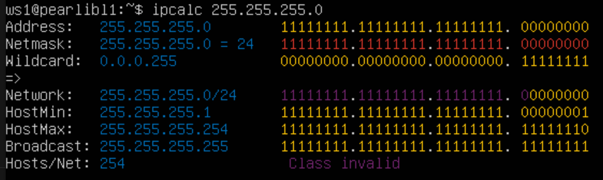

    Перевод маски */15* в обычную и двоичную: `ipcalc /15`

    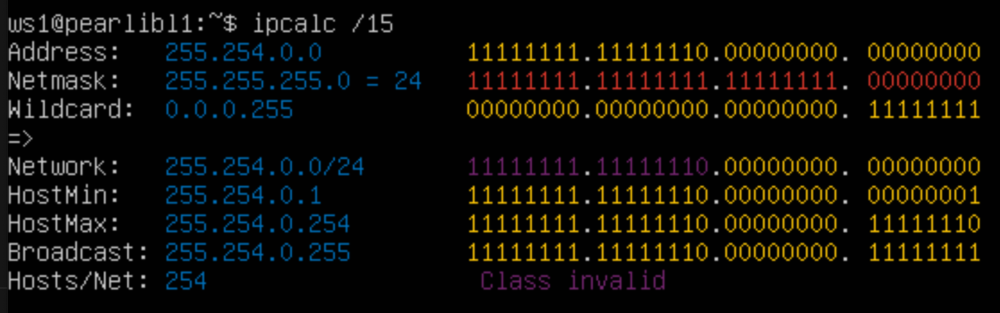

    Перевод маски *11111111.11111111.11111111.11110000* в обычную и префиксную.
    `ipcalc` не воспринимает адрес в таком формате поэтому обратимся к уже протестированным вариантам `ipcalc /28` или `ipcalc 255.255.255.240`

    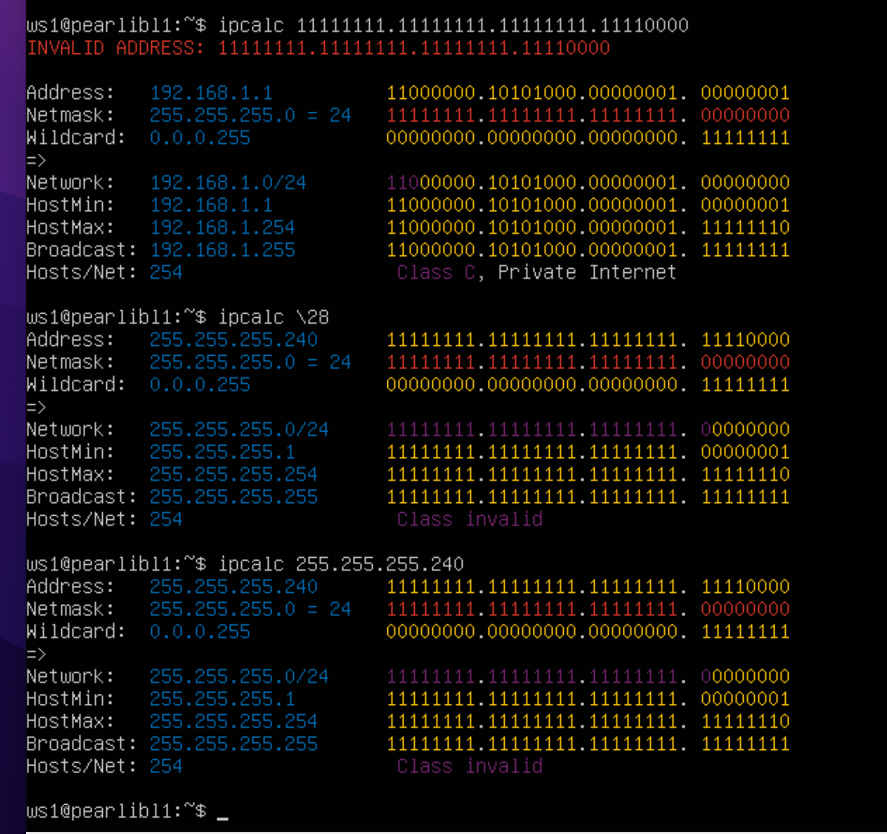

 3)  Для получения минимального и максимального хоста в сети вызовем команду `ipcalc your_address/your_mask`

    Минимальный  хост в сети 12.167.38.4 при маске /8 - `12.0.0.1`
    Максимальный хост в сети 12.167.38.4 при маске /8 - `12.255.255.254`
    
   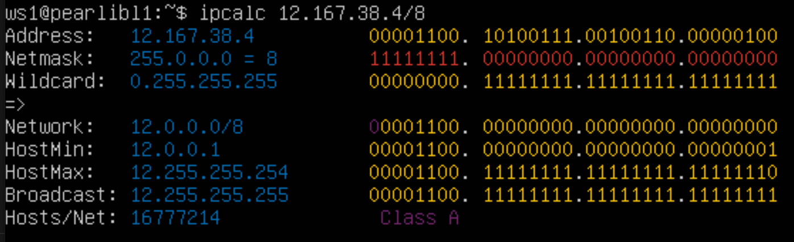

    Минимальный  хост в сети 12.167.38.4 
    при маске 11111111.11111111.00000000.00000000 - `12.167.0.1`
    Максимальный хост в сети 12.167.38.4 
    при маске 11111111.11111111.00000000.00000000 - `12.255.255.254`
   
   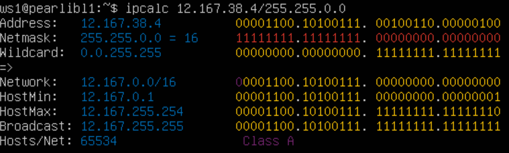

    Минимальный  хост в сети 12.167.38.4 при маске 255.255.254.0 - `12.167.38.1`
    Максимальный хост в сети 12.167.38.4 при маске 255.255.254.0 - `12.255.39.254`
   
   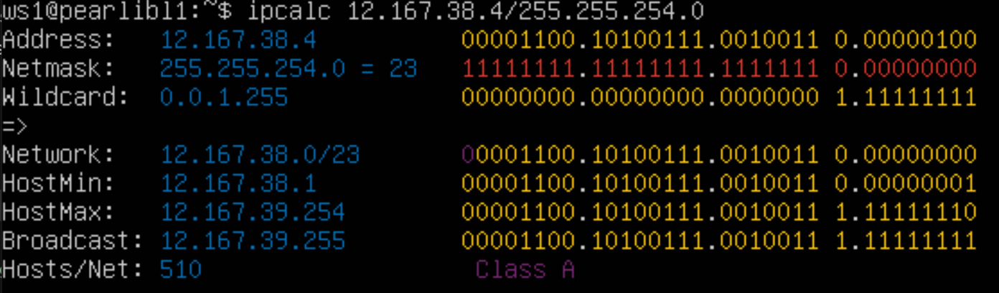
        
    Минимальный  хост в сети 12.167.38.4 при маске /4 - `0.0.0.1`
    Максимальный хост в сети 12.167.38.4 при маске /4 - `15.255.255.254`
    
   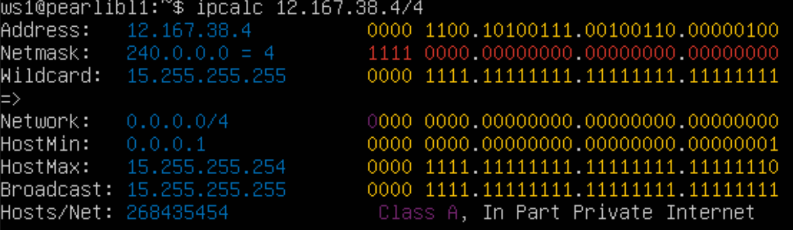

#### 1.2. localhost

Определить возможность обращения к приложению на localhost для определённого IP можно с помощью ipcalc.

В случаях с адресами  `127.0.0.2` и `127.1.0.1` мы видим в строке `Hosts/Net` пометку `Loopback`, что указывает на возможность использования этих адресов для доступа к службам на localhost:

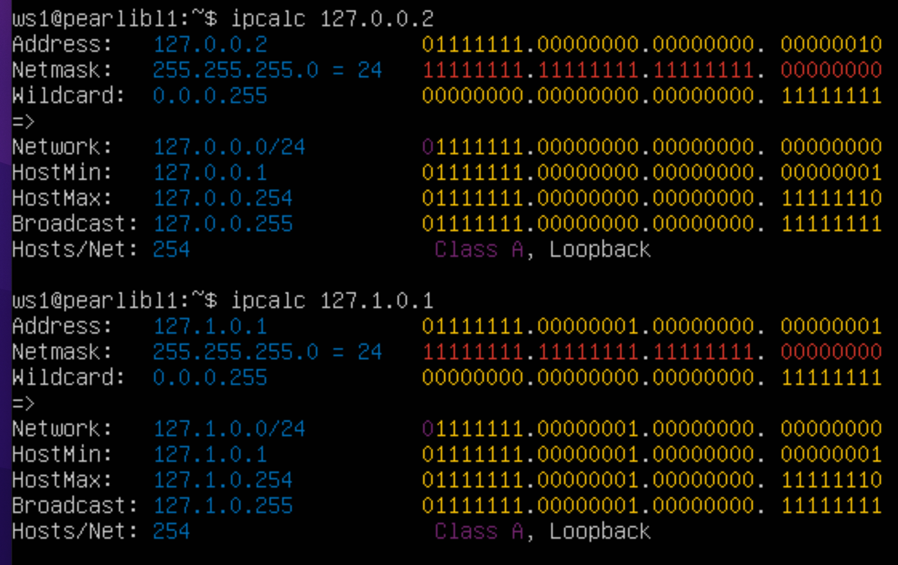

В случаях с адресами `194.34.23.100` и `128.0.0.1` в строке Hosts/Net отсутствует пометка Loopback, что означает отсутствие доступа к localhost через эти адреса:

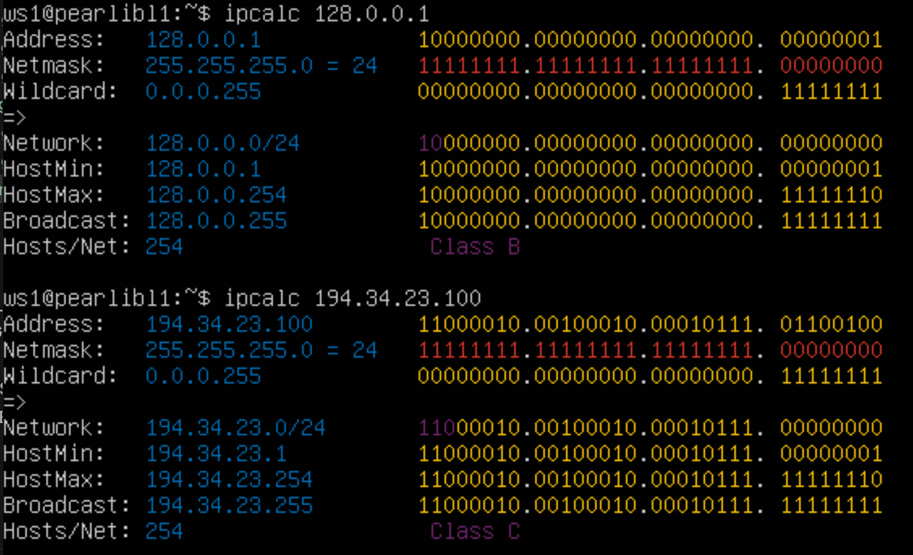

#### 1.3. Диапазоны и сегменты сетей

1) Определить какие из перечисленных IP можно использовать в качестве публичных, а какие в качестве частных можно при помощи того же приёма. Частные адреса будут иметь пометку `Private internet` в строке `Hosts/Net`. Проверим все прделоженные варианты. Как мы видим на скринах ниже, адреса *10.0.0.45*,*192.168.4.2*, *172.20.250.4*, *172.16.255.255*, *10.10.10.10* имеют такую пометку, а *134.43.0.2*,*172.0.2.1*, *192.172.0.1*,  *172.68.0.2*,*192.169.168.1* - нет.

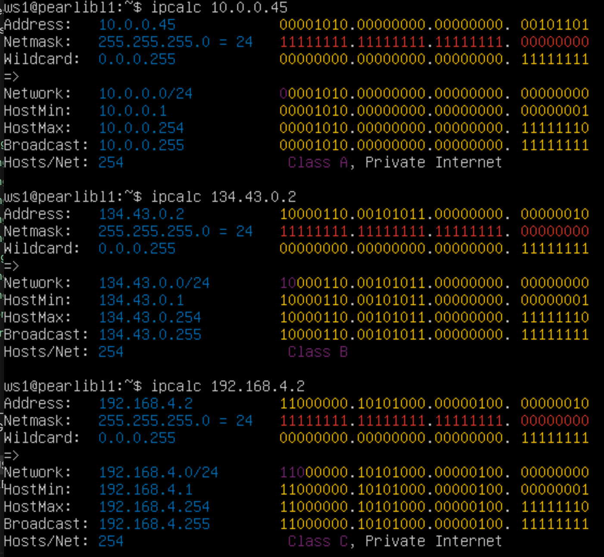
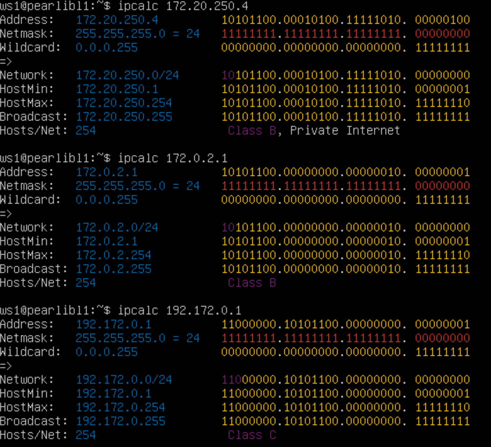
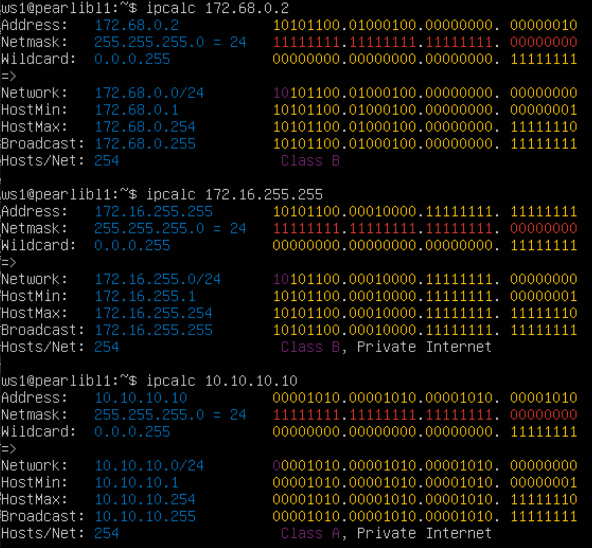
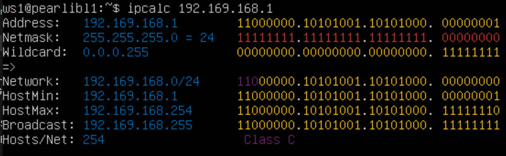

2) Определим, какие из перечисленных IP-адресов шлюза (*10.0.0.1*, *10.10.0.2*, *10.10.10.10*, *10.10.100.1*, *10.10.1.255*) возможны у сети *10.10.0.0/18*.
Для этого посмотрим в каком диапазоне у нас находятся доступные адреса.

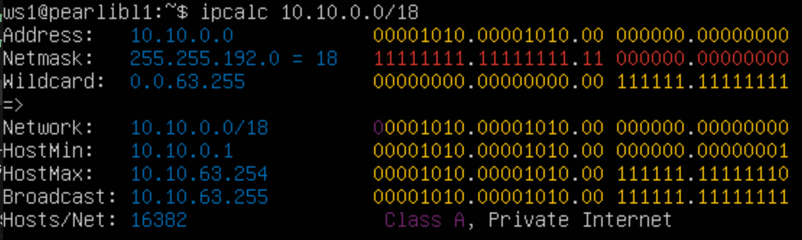

 Как мы видим, нас устраивают все адреса от 10.10.0.1 и до 10.10.63.254, а это адреса  `10.10.0.2` и `10.10.10.10`.

## Part 2. Статическая маршрутизация между двумя машинами

`-` Теперь разберёмся, как связать две машины, используя статическую маршрутизацию.
Поднимем две виртуальные машины (далее -- ws1 и ws2) и с помощью команды `ip a` посмотрим существующие сетевые интерфейсы.
`-` ws1:
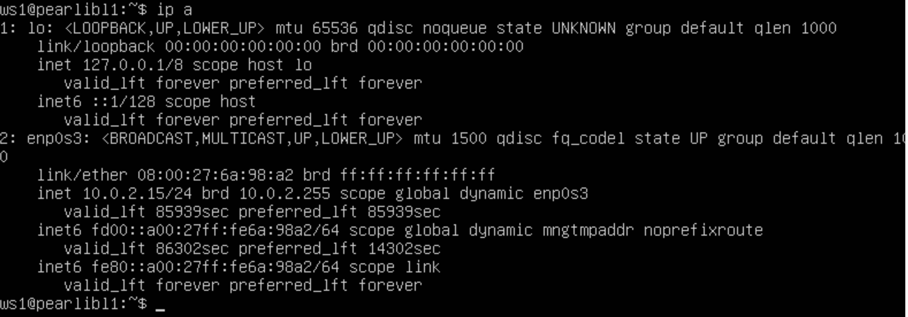

`-` ws2:
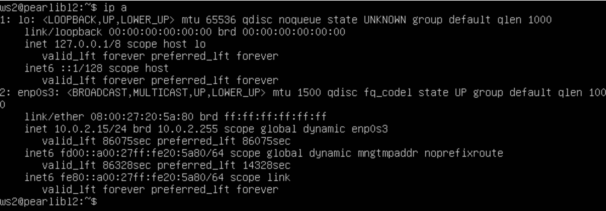


Анализ вывода команды `ip a` показал, что на обеих виртуальных машинах (ws1 и ws2) присутствует по два сетевых интерфейса:
- enp0s3 - основной сетевой интерфейс для подключения к сети
- lo (loopback) - виртуальный интерфейс для локальных соединений

Теперь пропишем адреса и маски согласно заданию отредактировав файл *etc/netplan/00-installer-config.yaml* на обеих машинах.
`-` ws1:
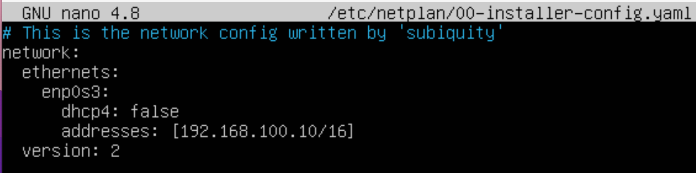

`-` ws2:
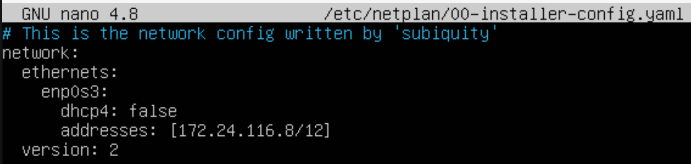

Теперь подтвердим внесённые изменения на обеих машинах при помощи команды `netplan apply`.

`-` ws1:
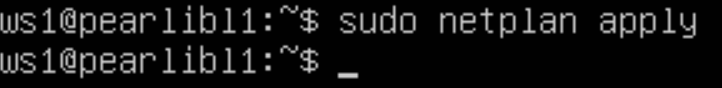

`-` ws2:
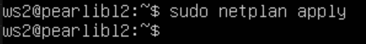

#### 2.1. Добавление статического маршрута вручную
 Добавим статический маршрут от одной машины до другой и обратно при помощи команды вида `ip r add` и пропингуем соединение между ними.

`-` ws1:
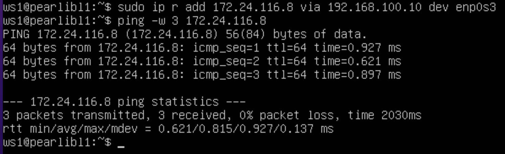

`-` ws2:
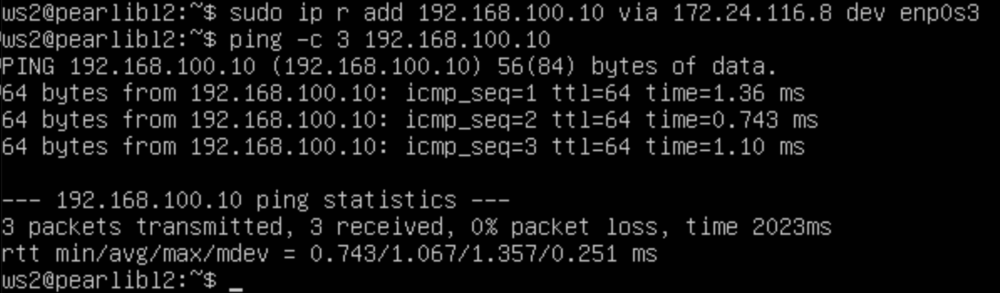
#### 2.2. Добавление статического маршрута с сохранением
    Перезапустим машины.
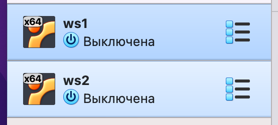

 Добавим статический маршрут от одной машины до другой с помощью файла */etc/netplan/00-installer-config.yaml*.

 `-` ws1:
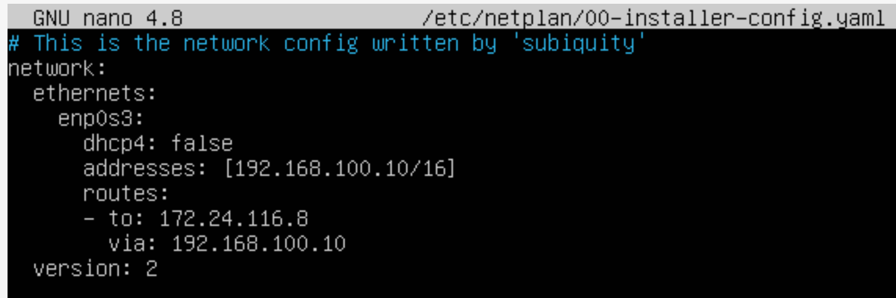

`-` ws2:
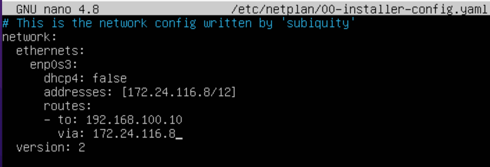

Теперь снова пропингуем соединение между машинами.

 `-` ws1:
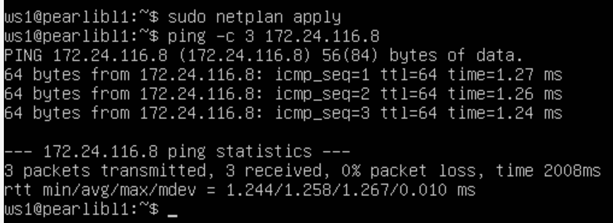

`-` ws2:
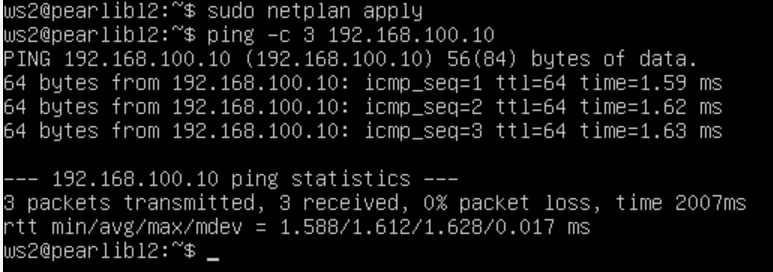

## Part 3. Утилита **iperf3**
#### 3.1. Скорость соединения

        Перевести и записать в отчёт: 8 Mbps в MB/s, 100 MB/s в Kbps, 1 Gbps в Mbps
        8 Mbps = 1 MB/s
        100 MB/s = 800000 Kbps
        1 Gbps = 1000 Mbps

#### 3.2. Утилита **iperf3**

    Измерим скорость соединения между ws1 и ws2.

iperf3 — это программа для измерения пропускной способности сети в реальном времени.
Является одним из инструментов для тестирования максимально достижимой пропускной способности в IP-сетях (поддерживает IPv4 и IPv6).
Чтобы протестировать пропускную способность сети, сначала нужно подключиться к удаленной машине, которую ты будешь использовать в качестве сервера, и запустить iperf3 в режиме сервера с помощью флага -s. По умолчанию он будет прослушивать порт 5201.

Используем ws2 в качестве сервера. Для этого пропишем команду `iperf3 -s`

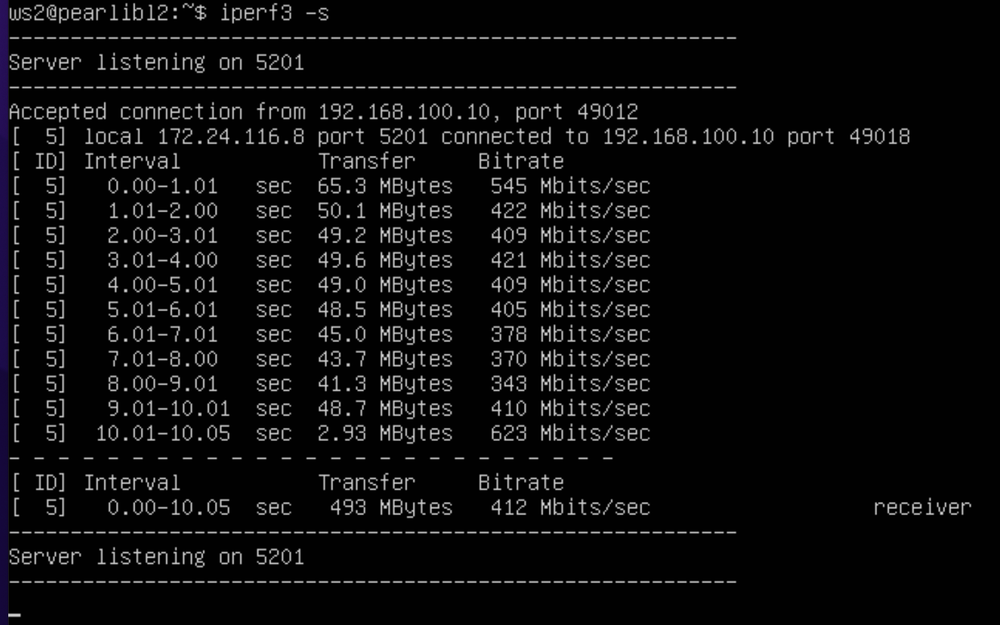

Теперь на второй машине(ws1) нужно воспользоваться этой же утилитой, только в клиентском режиме, для этого пропишем команду  *iperf3 -c* вместе с адресом сервера, к кторому мы хотим подключиться:`iperf3 -c 172.24.116.8`. После обмена пакетами между клиентом и сервером на стороне клиента мы получим вывод средней скороти этого процесса как для отправителя, так и для получателя:

 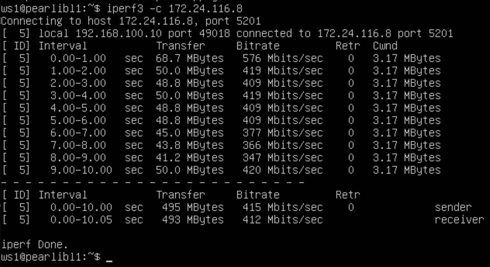

 - sender 415Mbits/sec
 - receiver 412Mbits/sec
 ## Part 4. Сетевой экран
#### 4.1. Утилита **iptables**
iptables — это утилита командной строки межсетевого экрана, которая использует цепочки policy для разрешения или блокирования трафика.
При попытке соединения с твоей системой iptables ищет в своем списке правило, которому она соответствует.
Если утилита его не находит, то прибегает к действию по умолчанию.
 Создадим файл */etc/firewall.sh*, имитирующий файрвол, на ws1 и ws2:
  
# Описание пакетов:
Input - Обрабатываются входящие подключения вроде подключения по протоколу SSH или при отправке на веб-сайт каких-либо файлов.

Forward - Цепочка формируется при активации проходящего соединения, когда информация предназначена «третьему» компьютеру, а текущий сервер выполняет роль маршрутизатора.

Output - Исходящие пакеты данных, например, при запуске какого-либо сайта в браузере или при проверке скорости соединения и доступности PING.

# Примеры действий:
ACCEPT – пропустить пакет данных далее по цепочке

DROP – полностью удалить пакет

REJECT – отклонить запрос и направить пользователю ответ с информацией об этом;

LOG – инициируется запись в лог-файл об обработанном пакете

QUEUE – отправка данных на компьютер пользователя

# Перечень основных действий, для выполнения которых используется Iptables:
-A – добавить правило в цепочку;
-C – проверить применяемые правила;
-D – удалить текущее правило;
-I – вставить правило с указанным номером;
-L – вывести правила текущей цепочки;
-S – вывести все активные правила;
-F – очистить все правила;
-N – создать цепочку;
-X – удалить цепочку;
-P – установить действие «по умолчанию».

#В качестве дополнительных параметров используются опции:
-p – вручную установить протокол (TCP, UDP, UDPLITE, ICMP, ICMPv6, ESP, AH, SCTP, MH);
-s – указать статичный IP-адрес оборудования, откуда отправляется пакет данных;
-d – установить IP получателя;
-i – настроить входной сетевой интерфейс;
-o – то же самое в отношении исходящего интерфейса;
-j – выбрать действие при подтверждении правила.

 По заданию нужно добавить в файл подряд следующие правила:
 1) На ws1 применить стратегию, когда в начале пишется запрещающее правило, а в конце пишется разрешающее правило (это касается пунктов 4 и 5).
 2) На ws2 применить стратегию, когда в начале пишется разрешающее правило, а в конце пишется запрещающее правило (это касается пунктов 4 и 5).
 3) Открыть на машинах доступ для порта 22 (ssh) и порта 80 (http).
 4) Запретить *echo reply* (машина не должна «пинговаться», т. е. должна быть блокировка на OUTPUT).
 5) Разрешить *echo reply* (машина должна «пинговаться»).
  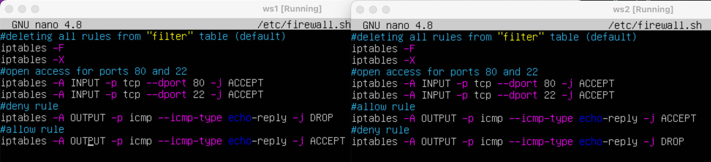

 Запустим файлы на обеих машинах командами `chmod +x /etc/firewall.sh` и `/etc/firewall.sh`.
 `iptables -L` покажет нам информацию об установленных правилах.
   
   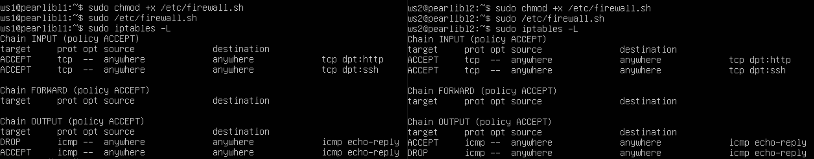
Как видим, все наши правила применились.
#### 4.2. Утилита **nmap**
 Командой **ping** найдём машину, которая не «пингуется»
 ws1->ws2   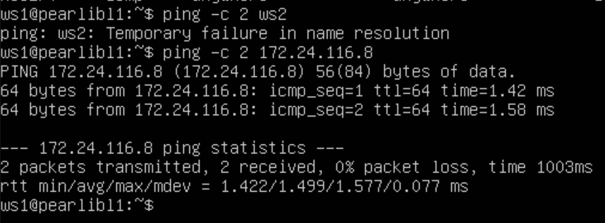

 ws2->ws1   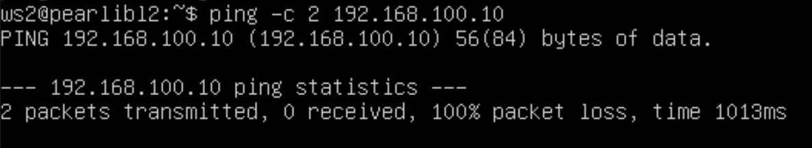

 Как видно по результатам вызова этих команд - мы можем пинговать только ws1 с ws2, но не в обратном направлении,
 что подверждает правильность выполненных нами ранее операций.
 Теперь утилитой **nmap** покажем, что хост машины запущен.
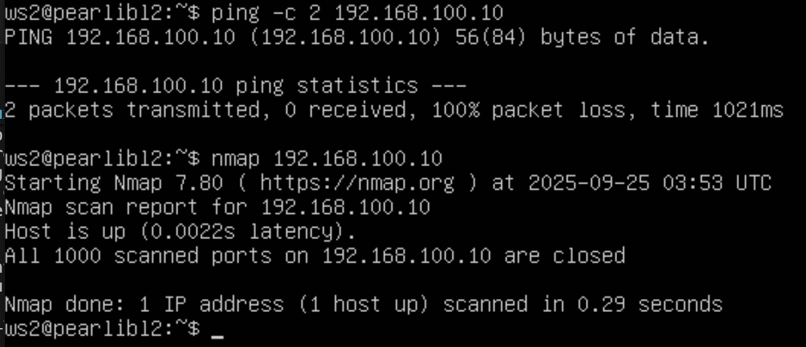

т.к. мы не смогли пингануть ws2->ws1 , то и проверку будем проводить со второй машины для первой.
как мы видим, несмотря на неудачу с пингом **nmap**  нам выдал состояние *`Host is up`*. Значит 
именно фильтр не пропускает наше обращение к ws1.

## Part 5. Статическая маршрутизация сети
**== Задание ==**

Сеть: \


Поднять пять виртуальных машин (3 рабочие станции (ws11, ws21, ws22) и 2 роутера (r1, r2)).

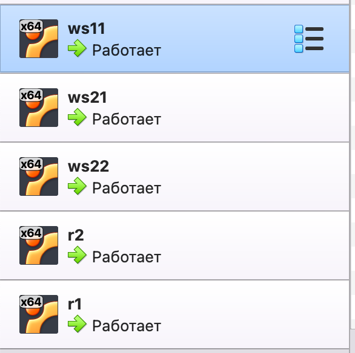

#### 5.1. Настройка адресов машин
 Для начала необходимо настроить конфигурации самих виртуальных машин добавив по 2 адаптера локльной сети в роутеры и по 1 в рабочие станции. Теперь настроем конфигурации машин в *etc/netplan/00-installer-config.yaml* согласно сети на рисунке.
 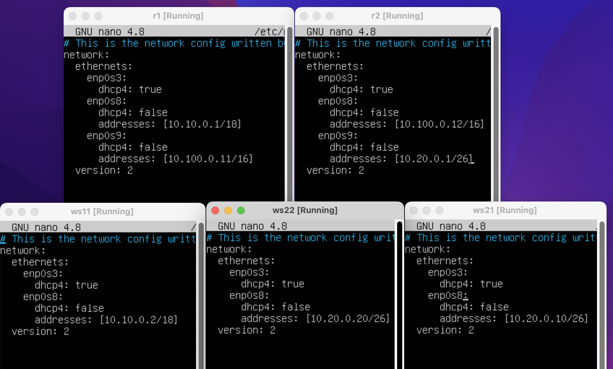

Далее перезапустим сервис сети и убедимся, что ошибок нет, командой `ip -4 a` проверим, что адрес машины задан верно. 

r1 и r2: 
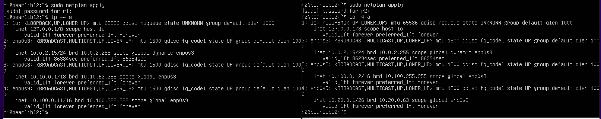

ws11,ws21,ws22: 
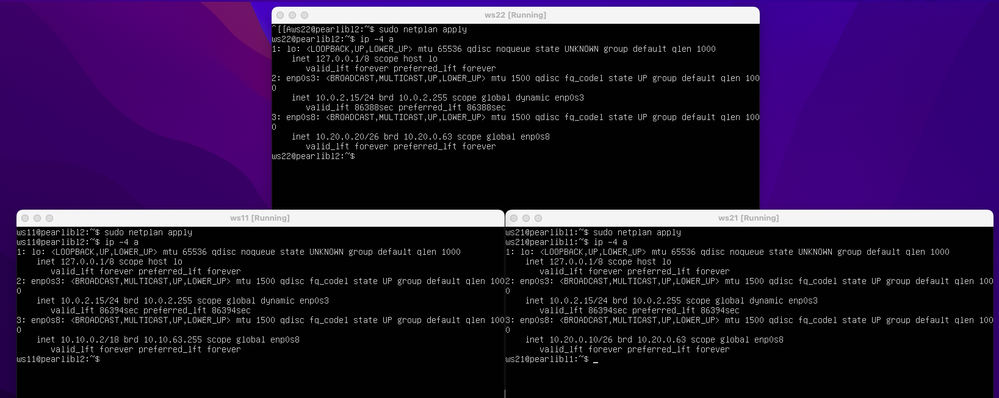

Также пропингуем ws22 с ws21:
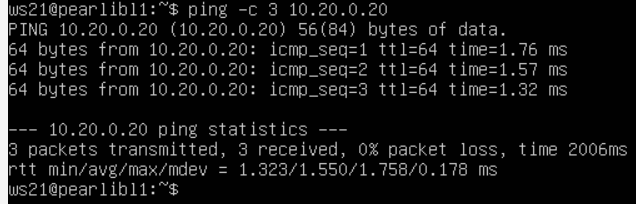

Аналогично пропингуем r1 с ws11:
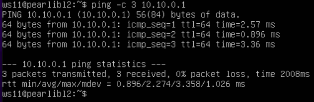

#### 5.2. Включение переадресации IP-адресов
Для включения переадресации IP выполним команду на роутерах:
`sysctl -w net.ipv4.ip_forward=1`
*При таком подходе переадресация не будет работать после перезагрузки системы.*
Команда включает пересылку пакетов IP на уровне ядра. Это позволяет маршрутизатору пересылать пакеты между разными подсетями в локальной сети.

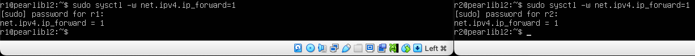

 - sysctl используется для настройки параметров ядра операционной системы.

 - -w указывает на то, что мы хотим изменить значение параметра.

 - net.ipv4.ip_forward - это имя параметра, который мы хотим изменить. Он отвечает за пересылку пакетов IP на уровне ядра.

 - 1 - это значение, которое мы устанавливаем для параметра, чтобы включить пересылку пакетов IP. Значение 0 отключает эту опцию.

 
Чтобы IP-переадресация была включена на постоянной основе, откроем файл */etc/sysctl.conf* и добавим в него строку `net.ipv4.ip_forward = 1` (раскомментируем):


#### 5.3. Установка маршрута по умолчанию
Пример вывода команды `ip r` после добавления шлюза:
```
default via 10.10.0.1 dev eth0
10.10.0.0/18 dev eth0 proto kernel scope link src 10.10.0.2
```
Настроем маршрут по умолчанию (шлюз) для рабочих станций. Для этого добавим `default` перед IP-роутера в файле конфигураций.
- скрины с содержанием файла *etc/netplan/00-installer-config.yaml*;

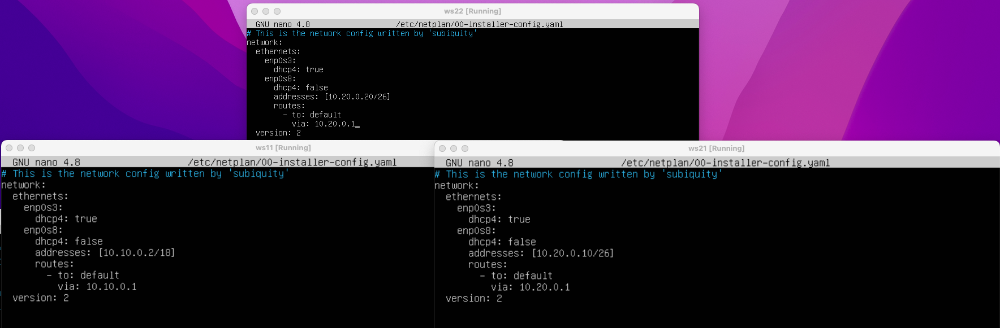

Теперь подвердим конфигурации командой `sudo netplan apply`, вызовем `ip r` и покажем, что маршрут добавился в таблицу маршрутизации.

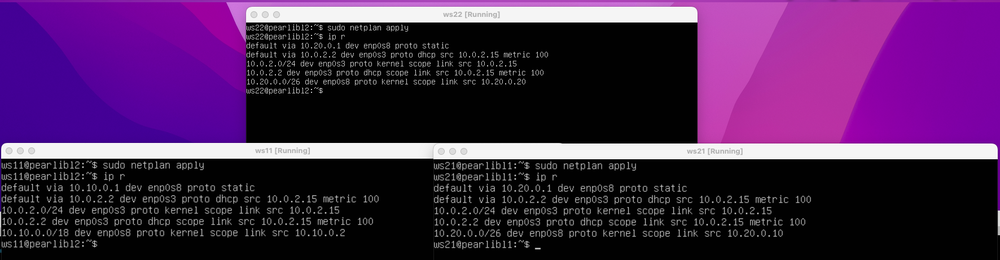

Пропингуем с ws11 роутер r2 и покажем на r2, что пинг доходит. Для этого используем команду
`tcpdump -tn -i eth0`. Эта утилита позволяет прослушать порты и вывести на экран информацию с каких IP адресов приходят пакеты.
`-tn`- опции для указания tcpdump о необходимости выводить только числовые IP-адреса вместо имён хостов. Опция `-n` отключает имя хоста, а опция `-t` отключает вывод временных меток.
`-i enp0s8` - опция для указания tcpdump о необходимости прослушивать сетевой интерфейс с именем `enp0s8`. Сетевые интерфейсы могут иметь различные имена в разных системах.

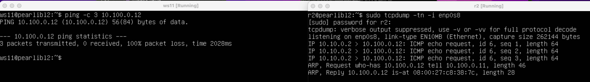

Как видно, утилита показывает нам, что с машины ws11 мы получили сигнал на роутере r2.

#### 5.4. Добавление статических маршрутов
Добавим в роутеры r1 и r2 статические маршруты в файле конфигураций. Пример для r1 маршрута в сетку 10.20.0.0/26:
```shell
# Добавь в конец описания сетевого интерфейса eth1:
- to: 10.20.0.0
  via: 10.100.0.12
```
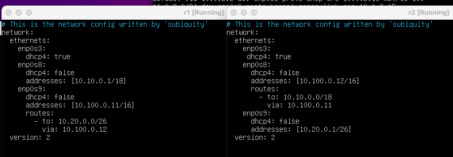

 Вызовем `ip r` и покажем таблицы с маршрутами на обоих роутерах. 
  
   

 Запустим команды на ws11:
`ip r list 10.10.0.0/[маска сети]` и `ip r list 0.0.0.0/0`

   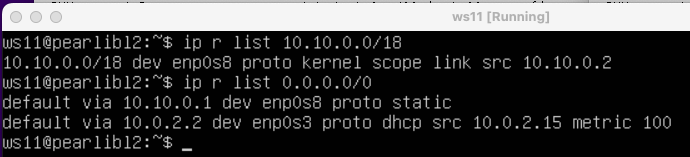

Почему для адреса 10.10.0.0/\[маска сети\] был выбран маршрут, отличный от 0.0.0.0/0, хотя он попадает под маршрут по умолчанию?
Ответ: Адреса 10.10.0.0/18 идут напрямую через enp0s8, а все остальные - через шлюз, потому что маршрут /18 более специфичен, чем default route /0.

#### 5.5. Построение списка маршрутизаторов
Пример вывода утилиты **traceroute** после добавления шлюза:
```
1 10.10.0.1 0 ms 1 ms 0 ms
2 10.100.0.12 1 ms 0 ms 1 ms
3 10.20.0.10 12 ms 1 ms 3 ms
```
Запустим на r1 команду дампа:
`tcpdump -tnv -i eth0`
 При помощи утилиты **traceroute** построим список маршрутизаторов на пути от ws11 до ws21.

   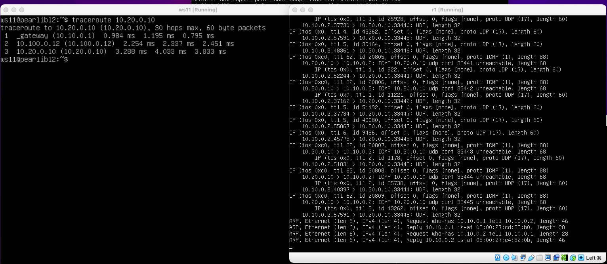

Traceroute работает, намеренно заставляя маршрутизаторы на пути уничтожать пакеты и жаловаться на это.
Он отправляет серию пакетов к цели, но искусственно ограничивает дальность их "полета" с помощью поля TTL (Time To Live). TTL — это счётчик прыжков. Каждый маршрутизатор на пути уменьшает TTL на 1.
Сначала отправляется пакет с TTL=1. Первый же маршрутизатор уменьшает TTL до 0, пакет уничтожается, и маршрутизатор отправляет обратно вашему компьютеру сообщение «Time Exceeded». Traceroute фиксирует адрес этого маршрутизатора и время отклика.
Затем отправляется пакет с TTL=2. Он доходит до второго маршрутизатора, там TTL становится 0, и второй маршрутизатор так же жалуется обратно. Процесс повторяется с постепенным увеличением TTL, пока пакет, наконец, не достигнет конечной цели, которая отвечает окончательным подтверждением. Таким образом, последовательно раскрывается вся цепочка маршрутизаторов.

#### 5.6. Использование протокола **ICMP** при маршрутизации
ICMP (Internet Control Message Protocol) - служебный протокол для диагностики сети.
Запустим на r1 перехват сетевого трафика, проходящего через eth0 с помощью команды:
`tcpdump -n -i eth0 icmp`
Пропингуем с ws11 несуществующий IP (например, *10.30.0.111*) с помощью команды:
`ping -c 1 10.30.0.111`. Получаем:

   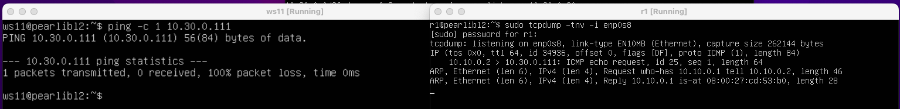

На маршрутизаторе R1 зафиксирован ICMP Echo Request (запрос эха), но ответ (Echo Reply) не был получен, так как адрес 10.30.0.111 отсутствует в сети.

## Part 6. Динамическая настройка IP с помощью **DHCP**

**== Задание ==**
##### Для r2 настроим в файле */etc/dhcp/dhcpd.conf* конфигурацию службы **DHCP**:
 1) Укажем адрес маршрутизатора по умолчанию, DNS-сервер и адрес внутренней сети. Пример файла для r2:
```shell
subnet 10.100.0.0 netmask 255.255.0.0 {}

subnet 10.20.0.0 netmask 255.255.255.192
{
    range 10.20.0.2 10.20.0.50;
    option routers 10.20.0.1;
    option domain-name-servers 10.20.0.1;
}
```
   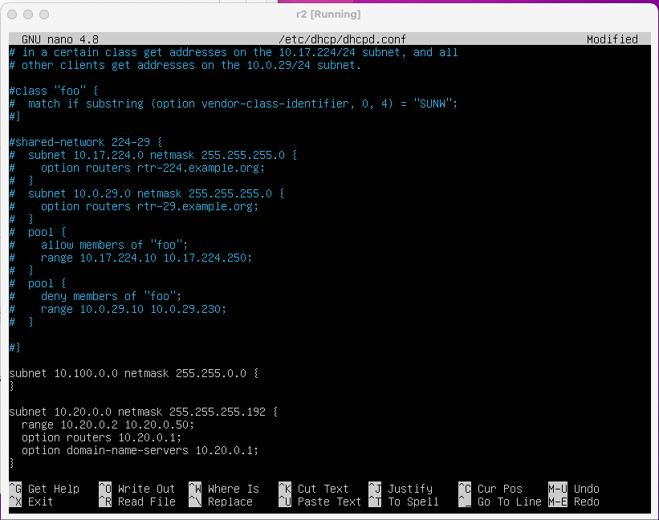

 2) В файле *resolv.conf* пропишем `nameserver 8.8.8.8`.
   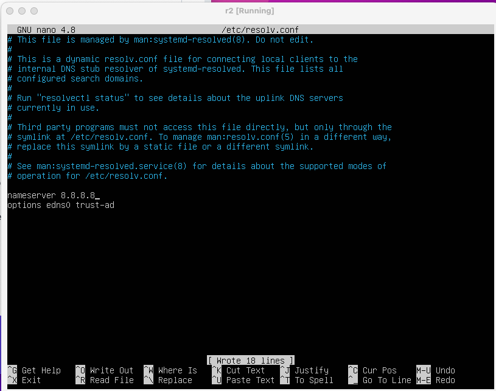
   Теперь перезагрузим службу **DHCP** командой `systemctl restart isc-dhcp-server`.
   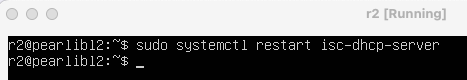
Для получения динамических адресов нам так же нужно изменить значение dhcp4 на true для наших машин:
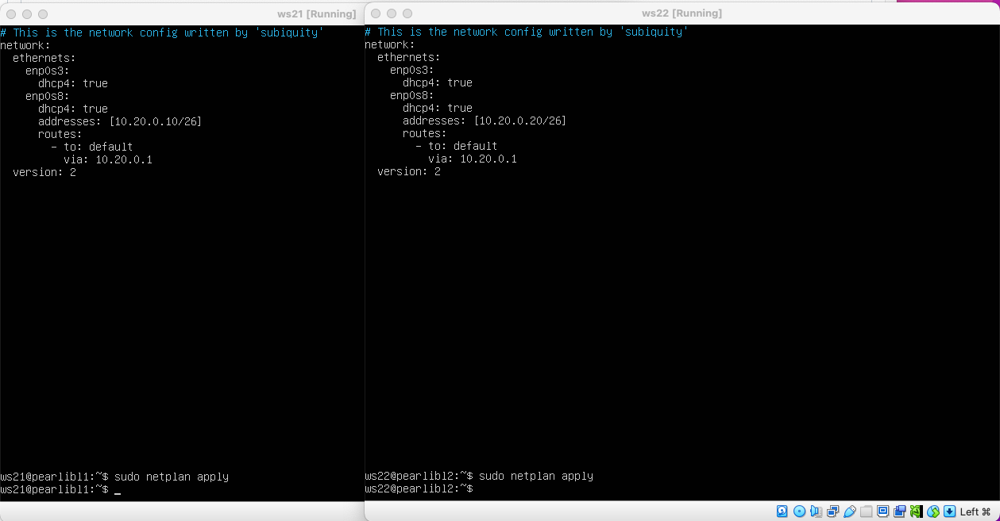
 Машину ws21 перезагрузим при помощи `reboot` и через `ip a` покажем, что она получила адрес. Также пропингуем ws22 с ws21. Для этого мы так же пропишем команду `ip a` на ws22 и посмотрим какой адрес получила машина, после чего пропингуем его с ws21:

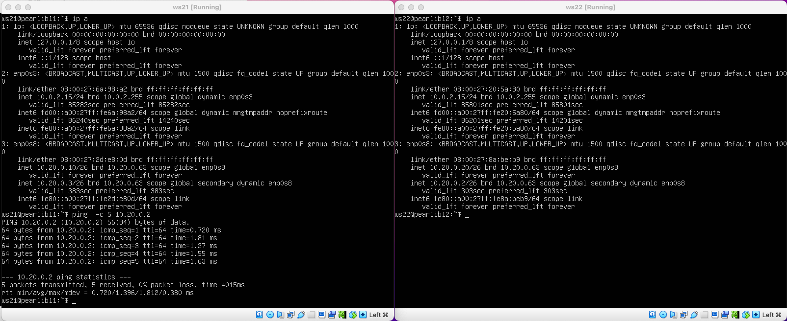

 Укажем MAC-адрес у ws11, для этого в *etc/netplan/00-installer-config.yaml* надо добавить строки: `macaddress: 10:10:10:10:10:BA`, `dhcp4: true`.
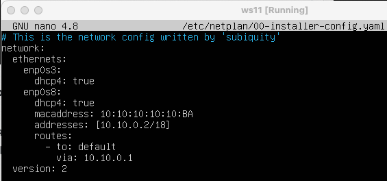

 так же мне пришлось изменить мак адрес самой виртуалки вручную:
 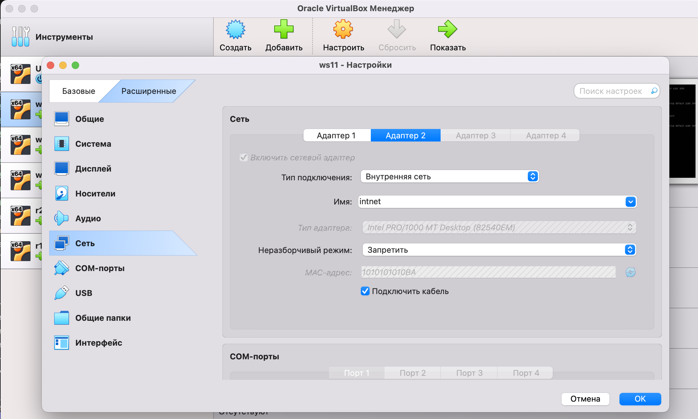

 Для r1 настроим аналогично r2, но сделаем выдачу адресов с жесткой привязкой к MAC-адресу (ws11) и проведём аналогичные тесты:

 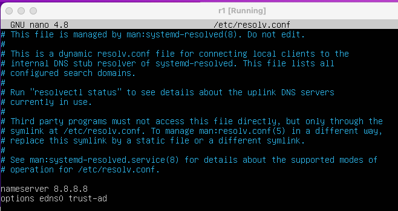
 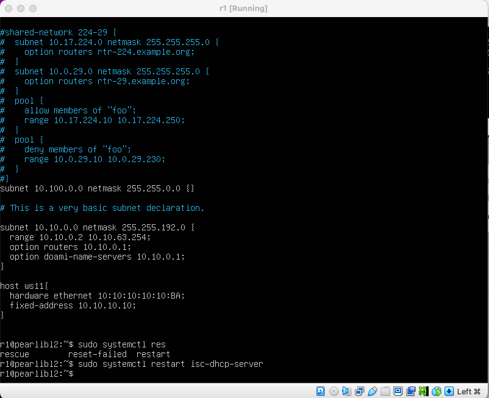
 повторим все шаги из пункта выше 
 видим, что наш ip из конфигурации был принят:
  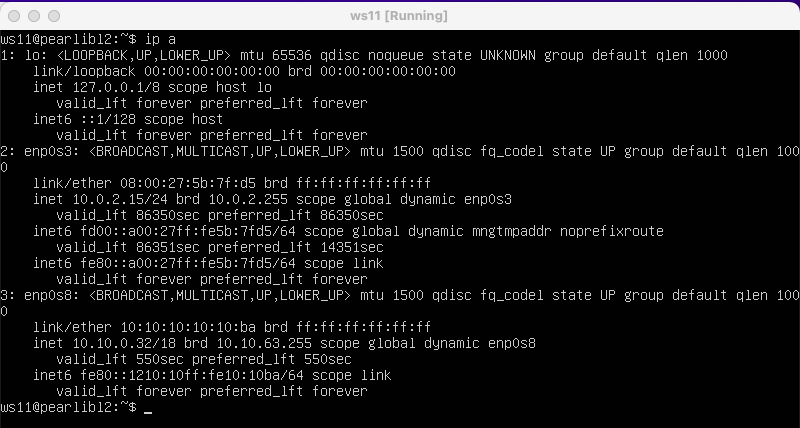
Для ещё одной проверки попробуем пропинговать наш адрес (10.10.0.32) с другой машины, например ws22:
  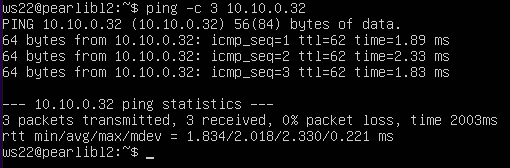


 Запрос с ws21 обновление IP-адреса:
Для начала нам нужно отказаться от аренды используемого адреса командой `sudo dhclient -r emp0s8`, но, как мы видим, этого ещё недостаточно:
  
  

Локально IP-адрес остаётся на интерфейсе до тех пор, пока не будет выполнен явный сброс (ip addr flush), не истечёт срок действия (valid_lft), либо же не будет перезапущен интерфейс:

  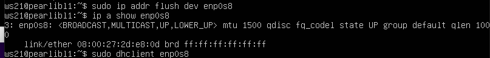
Теперь, когда мы избавились от старого адреса, попробуем обзавестись новым при помощи команды `sudo dhclient emp0s8`:

  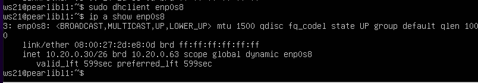

Как видим, старый адрес был изменён.
В данному пункте были использованы такие опции DHCP как:
*option routers* - указывает шлюз по умолчанию для клиентов DHCP.
*option domain-name-servers* - определяет DNS-серверы, которые будут использоваться клиентами для разрешения DNS-имен в IP-адреса.
*option domain-name* - задает имя домена по умолчанию, которое будет использоваться клиентами DHCP.

## Part 7. **NAT**

 В файле */etc/apache2/ports.conf* на ws22 и r1 изменим строку `Listen 80` на `Listen 0.0.0.0:80`, то есть сделай сервер Apache2 общедоступным.

   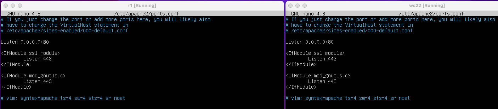

 Запустим веб-сервер Apache командой `service apache2 start` на ws22 и r1 и проверим его статус.

   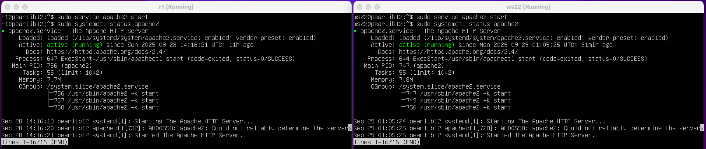


 Добавим в фаервол, созданный по аналогии с фаерволом из Части 4, на r2 следующие правила:
 1) Удаление правил в таблице filter — `iptables -F`;
 2) Удаление правил в таблице «NAT» — `iptables -F -t nat`;
 3) Отбрасывать все маршрутизируемые пакеты — `iptables --policy FORWARD DROP`.

   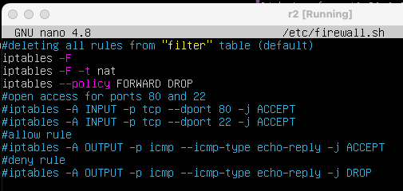

 Запустим файл также, как в Части 4.

   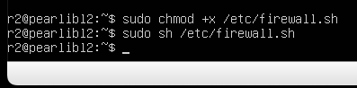

Теперь проверим соединение между ws22 и r1 командой `ping`.
*При запуске файла с этими правилами, ws22 не должна «пинговаться» с r1.*
на всякий случий так же сначала узнаем, а затем и пропингуем ещё и динамечский адрес машины

   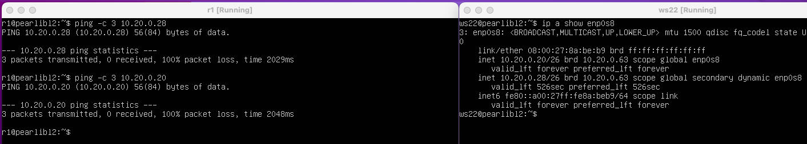

 Как видно - обратной связи не наблюдается в обоих случаях.

 Добавим в файл ещё одно правило:

 4) Разрешим маршрутизацию всех пакетов протокола **ICMP**.

   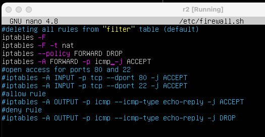

 и запустим файл также, как запускали его выше.
 Ещё раз проверим соединение между ws22 и r1 командой `ping`.

   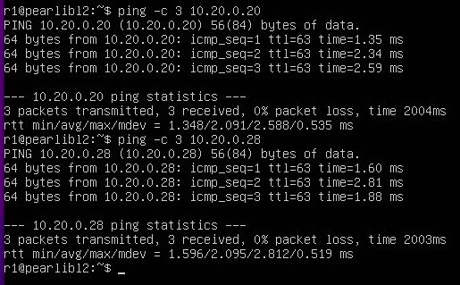

*Как видим, после запуска файла с этими правилами, ws22 «пингуется» с r1.*

 Добавим в файл ещё два правила:
 5) Включим **SNAT**, а именно маскирование всех локальных IP из локальной сети, находящейся за r2 (по обозначениям из Части 5 — сеть 10.20.0.0).
 6) Включим **DNAT** на 8080 порт машины r2 и добавим к веб-серверу Apache, запущенному на ws22, доступ извне сети.

 SNAT (Source Network Address Translation) и DNAT (Destination Network Address Translation) - это два типа трансляции IP-адресов, используемых для изменения адресов источника и назначения в IP-пакетах при прохождении через маршрутизатор.

**SNAT** используется для изменения IP-адреса источника, когда пакет покидает локальную сеть и направляется во внешнюю сеть. Это позволяет скрыть реальный IP-адрес отправителя и использовать общедоступный IP-адрес маршрутизатора в качестве источника пакета.

**DNAT** используется для изменения IP-адреса назначения, когда пакет приходит во входящий интерфейс маршрутизатора. Это позволяет перенаправить трафик на другой IP-адрес в локальной сети, скрыть реальный IP-адрес получателя или разрешить доступ к локальным ресурсам из внешней сети.

   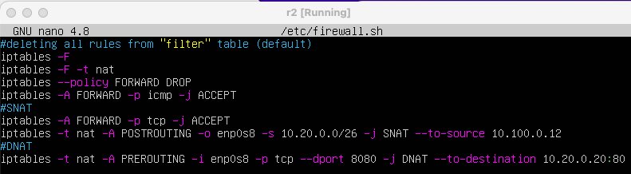

Запустим изменённый файл как в Части 4.

*Перед тестированием рекомендуется отключить сетевой интерфейс **NAT** (его наличие можно проверить командой `ip a`) в VirtualBox, если он включен.*

   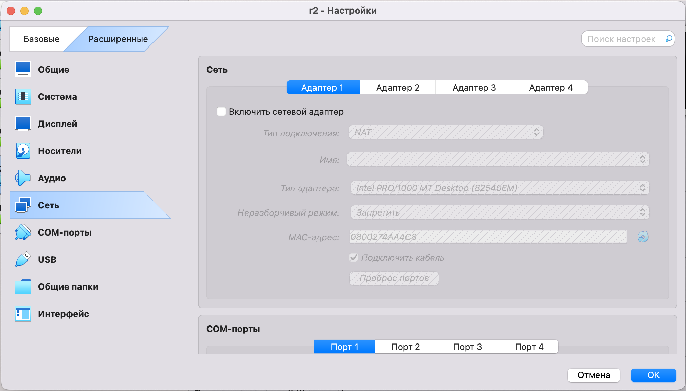

 Проверим соединение по TCP для **SNAT**: для этого с ws22 нужно подключиться к серверу Apache на r1 командой: `telnet [адрес] [порт]`
 Telnet - это протокол прикладного уровня, использующийся для удаленного управления устройствами через интернет или локальную сеть. С помощью Telnet можно подключаться к серверам, обычно по протоколу TCP, и взаимодействовать с ними, отправляя команды и получая ответы.
Подключаемся к серверу apache установленному на r1 с ws22: *telnet 10.100.0.11 80*

   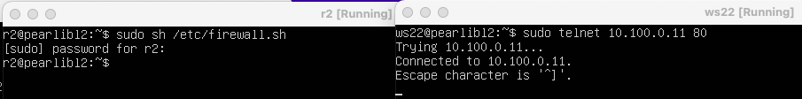

 Проверим соединение по TCP для **DNAT** подключившись с r1 к серверу Apache на ws22 командой `telnet` (обращаться следует по адресу r2 и порту 8080).
 Для этого обратимся по ip, который мы перехватили с помощью tcpdump: *telnet 10.100.0.12 8080*

   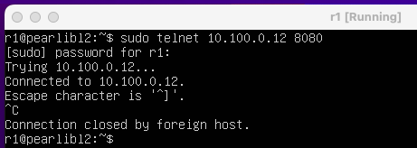

## Part 8. Дополнительно. Знакомство с **SSH Tunnels**

**== Задание ==**

*В данном задании используются виртуальные машины из Части 5.*

Запустим на r2 фаервол с правилами из Части 7, а так же запустим веб-сервер **Apache** на ws22 только на localhost (то есть в файле */etc/apache2/ports.conf* измени строку `Listen 80` на `Listen localhost:80`).

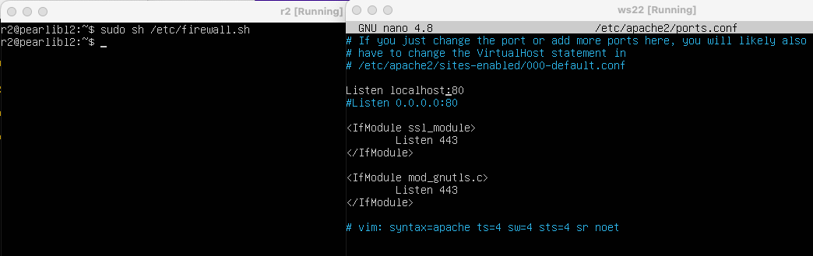

проверим, что сервер запустился.

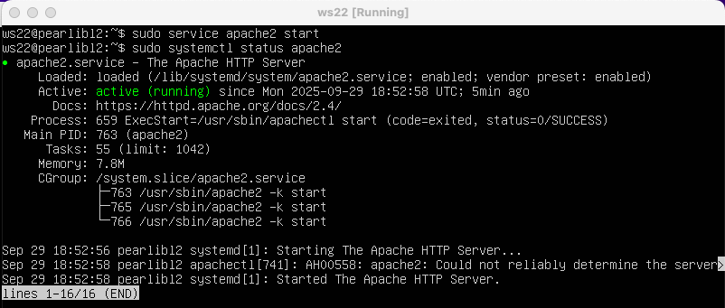

Воспользуемся *Local TCP forwarding* с ws21 до ws22, чтобы получить доступ к веб-серверу на ws22 с ws21.(необходимо, чтобы на машине ws22 был установлен *SSH сервер*, так как по умолчанию имеется только клиент).

Local TCP forwarding (также известен как локальное перенаправление портов) - это метод использования SSH для перенаправления трафика между клиентской машиной и сервером SSH. Этот метод позволяет клиентской машине использовать SSH-соединение как "прокси-сервер" для обращения к удаленным ресурсам.`

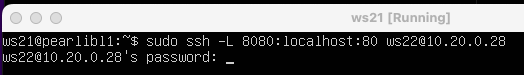

Команда *ssh -L 8080:localhost:80 ws22@10.20.0.28* создает туннель, который перенаправляет трафик с порта 8080 на ws21 на порт 80 веб-сервера Apache на ws22. После установки соединения и ввода пароля, доступ к веб-серверу ws22 осуществляется через `http://localhost:8080` на машине ws21. Для закрытия туннеля используется команда *exit*.

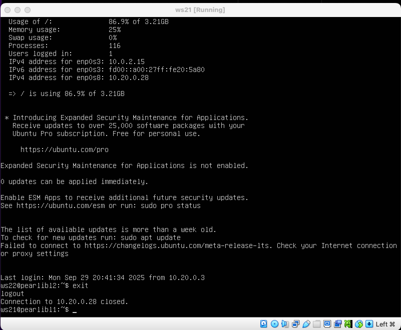

 Воспользуемся *Remote TCP forwarding* c ws11 до ws22, чтобы получить доступ к веб-серверу на ws22 с ws11. Заменим `-L` на `R`

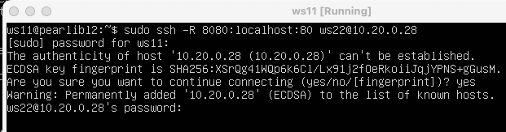

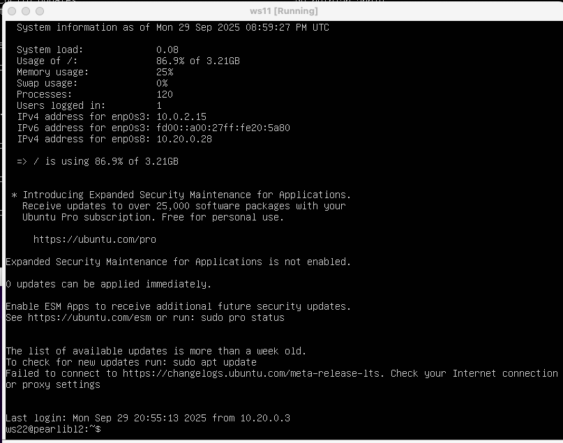

Для проверки, сработало ли подключение в обоих предыдущих пунктах, перейди во второй терминал (например, клавишами Alt + F2) и выполни команду:`telnet 127.0.0.1 [локальный порт`
ws 11:

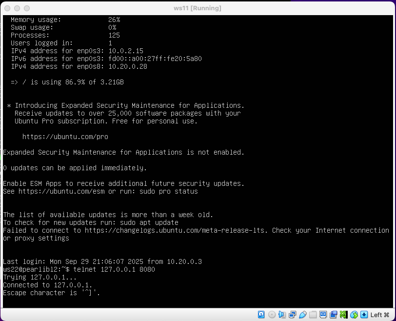

ws 21:

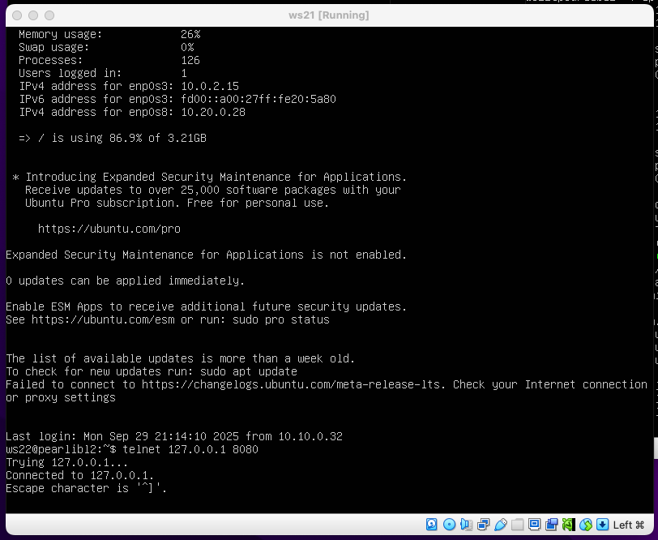

В связи с отсутствием графического интерфейса, туннели запускались в фоновом режиме с флагами -f -N(*f* - запуск в фоне, *N* - не выполнять команды, только туннель), а проверка выполнялась в том же терминале:

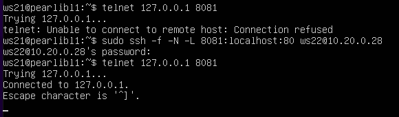

Local forwarding открывает порт на машине-инициаторе (ws21), а Remote forwarding - на машине-цели (ws22).
