# Basic CI/CD

  1. [Настройка gitlab-runner](#part-1-настройка-gitlab-runner)  \
  2. [Сборка](#part-2-сборка)  \
  3. [Тест кодстайла](#part-3-тест-кодстайла)   \
  4. [Интеграционные тесты](#part-4-интеграционные-тесты)  \
  5. [Этап деплоя](#part-5-этап-деплоя)  \
  6. [Дополнительно. Уведомления](#part-6-дополнительно-уведомления)

  ### Part 1. Настройка **gitlab-runner**

**== Задание ==**

##### Подними виртуальную машину *Ubuntu Server 22.04 LTS*.
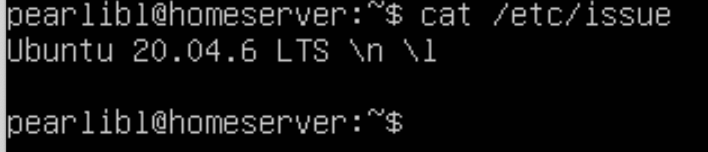

*Будь готов, что в конце проекта нужно будет сохранить дамп образа виртуальной машины.*

##### Скачай и установи на виртуальную машину **gitlab-runner**.

Установить лучше по прямой ссылке(актуальную версию), так как в образе *Ubuntu Server 20.04 LTS* хранится старая версия, не поддерживающая часть операций.
Для этого выполним команды:
 1. Установим зависимости
sudo apt update
sudo apt install -y curl ca-certificates

 2. Добавим официальный репозиторий GitLab Runner
curl -L https://packages.gitlab.com/install/repositories/runner/gitlab-runner/script.deb.sh | sudo bash

 3. Установим пакет
sudo apt install -y gitlab-runner
Если после этого команда sudo ls -ld /var/lib/gitlab-runner скажет, что такой директории нет, то может понадобиться небольшая ручная донастройка(см. скрин ниже). 

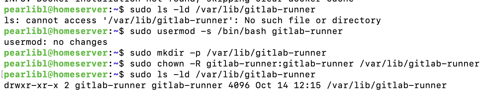

 4. Проверим версию
gitlab-runner -v

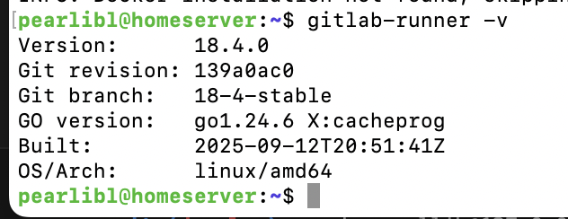

##### Запусти **gitlab-runner** и зарегистрируй его для использования в текущем проекте (*DO6_CICD*).
Прописываем команды:
- sudo systemctl enable gitlab-runner 
- sudo systemctl start gitlab-runner
- sudo systemctl status gitlab-runner
 Благодаря первой команде служба gitlab-runner будет автоматически запускаться при старте системы, второй - дали команду для запуска, а третьей - проверили,  что всё завершилось без ошибок и сервис активен.

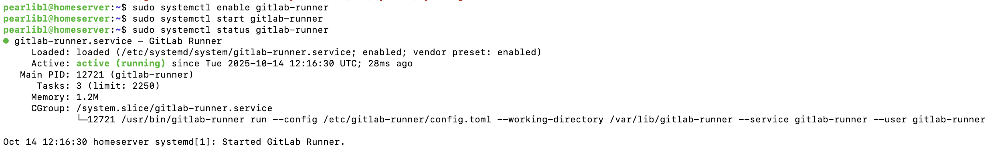

- Для регистрации понадобятся URL и токен, которые можно получить на страничке задания на платформе.
 Для начала регистрации мы прописываем команду `sudo gitlab-runner register`. После чего последовательно заполняем предлагаемые поля. В качестве Executor для нашего задания лучше остановиться на shell, чтобы команды из .gitlab-ci.yml выполнялись прямо в нашей системе.

Как только мы успешно завершили регистрацию, Runner сохраняет свой конфиг в файле */etc/gitlab-runner/config.toml*.
Как только этот файл появляется (и служба включена), systemd немедленно перезапускает сервис (он следит за состоянием), и Runner делает:
- Запрос к https://git.21-school.ru/ с новым authentication token;
- Отправляет свои метаданные (executor=shell, description, URL и т.д.);
- Получает подтверждение — и становится “active” в интерфейсе GitLab.

После этого командами `sudo gitlab-runner status` и `sudo gitlab-list` можно убедиться, что сервис активировался и наш runner появился в списке.

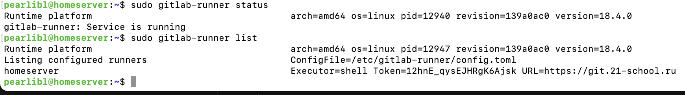

### Part 2. Сборка

**== Задание ==**

Напиши этап для **CI** по сборке приложений из проекта *SimpleBashUtils*.
В файле _.gitlab-ci.yml_ добавь этап запуска сборки через мейк файл из проекта _SimpleBashUtils_.
Файлы, полученные после сборки (артефакты), сохрани в произвольную директорию со сроком хранения 30 дней.

**== Если проект *SimpleBashUtils* не выполнен ==**

Напиши этап для **CI** по сборке приложения из папки code-samples *DO*.
В файле _.gitlab-ci.yml_ добавь этап запуска сборки через мейк файл из папки code-samples.
Файлы, полученные после сборки (артефакты), сохрани в произвольную директорию со сроком хранения 30 дней.

Т.к. у меня на машине есть рабочий проект *SimpleBashUtils*, то остановимся на первом варианте.
Создадим файл _.gitlab-ci.yml_ и разместим его в корне проекта, в папку src я добавил директории cat и grep из проекта *SimpleBashUtils*. Структура проекта на этом этапе выглядит так: 

 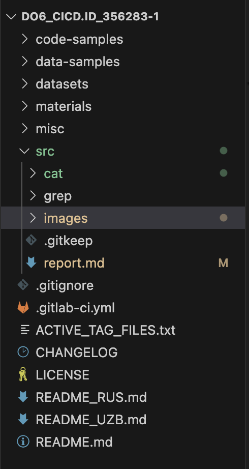

Теперь заполним файл .gitlab-ci.yml:

 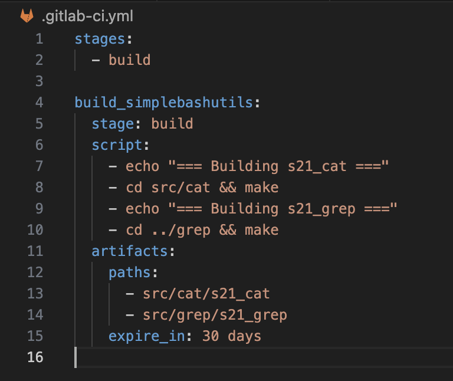

- stages: Определяет этапы CI/CD пайплайна.
- build_simplebashutils: Это job, которая выполняется на этапе build.
- script: Набор команд, выполняемых в shell на раннере. Тут — вызовы make для двух утилит.
- artifacts: Указывает, какие файлы GitLab должен сохранить после сборки.
- paths: Пути к собранным бинарникам. Они совпадают с тем, что создаётся при make.
- expire_in: 30 days GitLab автоматически удалит артефакты через 30 дней.

Если всё настроено и прописано правильно, то на сайте GitLab в разделе `pipelines`, появится новый пайплайн со статусом `Passed`, как показано ниже.

 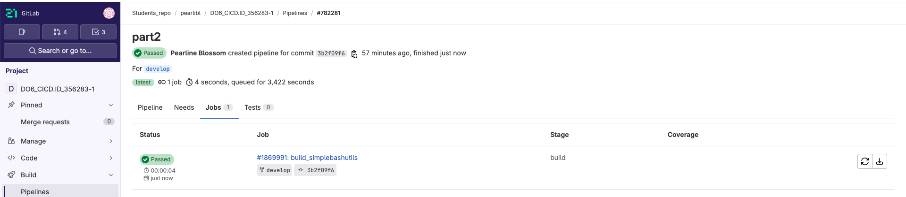

 Во вкладке Artifacts также отображаются исполняемые файлы, полученные в результате выполнения команды make:

 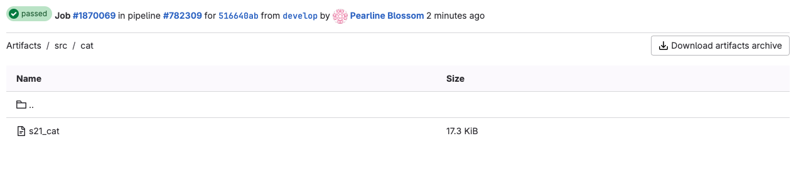
 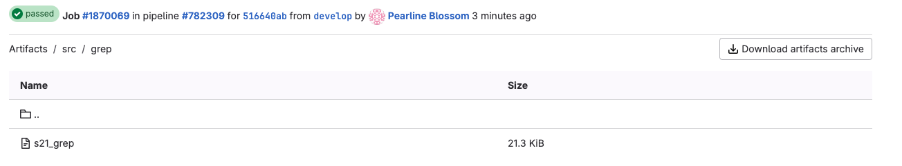

### Part 3. Тест кодстайла

**== Задание ==**

#### Напиши этап для **CI**, который запускает скрипт кодстайла (*clang-format*).
##### Если кодстайл не прошел, то «зафейли» пайплайн.
##### В пайплайне отобрази вывод утилиты *clang-format*.

Для этого просто добавим в наш файл ещё одну стадию, которая запускает *clang-format* для проверки кодстайла:

 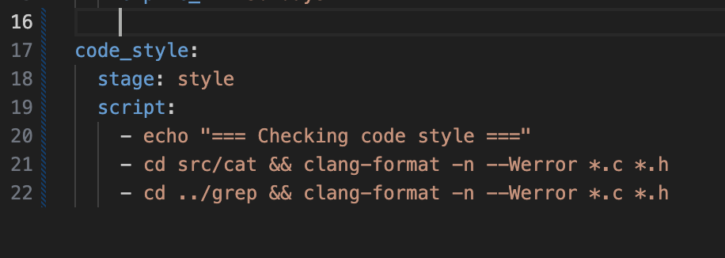

Первые две попытки у меня завалились. 

 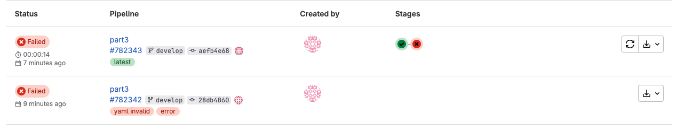

1. т.к. я не указал стадию вверху документа yaml.
2. в связи с тем, что на моём сервере не был усталновлен clang-format, так как под это проект я использовал чистый образ Ubuntu Server LTS.

Устанавливаем clang-format и нажимаем на кнопку `Retry` на страничке гитлаба: 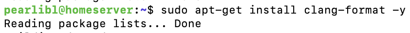

Теперь мы видим, что пайплайн изменил статус на `Passed`, значит тест был пройден успешно.

 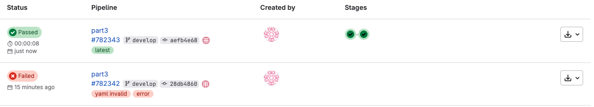

### Part 4. Интеграционные тесты

**== Задание ==**

#### Напиши этап для **CI**, который запустит интеграционные тесты.
##### Для проекта *SimpleBashUtils* можешь взять свои уже написанные интеграционные тесты.
##### Для проекта из папки code-samples напиши интеграционные тесты самостоятельно. Тесты могут быть написаны на любом языке (c, bash, python и т.д.) и должны вызывать собранное приложение для проверки его работоспособности на разных случаях.
Для тестирования проекта из папки code-samples я добавил в Makefile новый таргет, который сравнивает вывод написанной программы с ожидаемым текстом:

 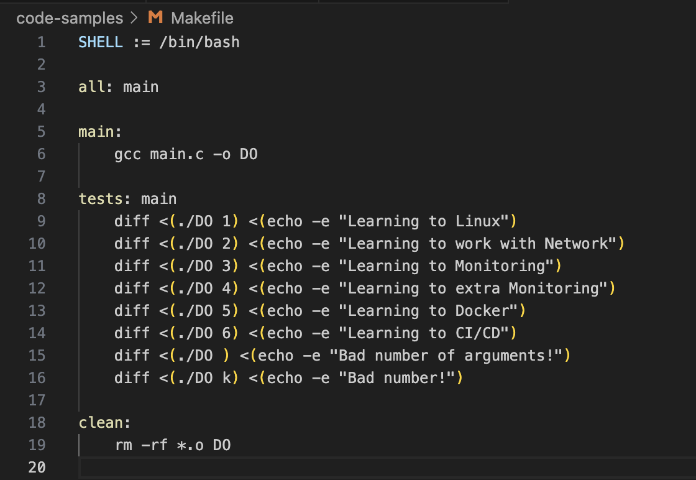

Тесты утилит cat и grep уже находятся в соответствующих папках и тоже запускаются через свои мейки.Теперь просто добавим новую стадию *test* и пропишем  job’ы для каждого проекта:

 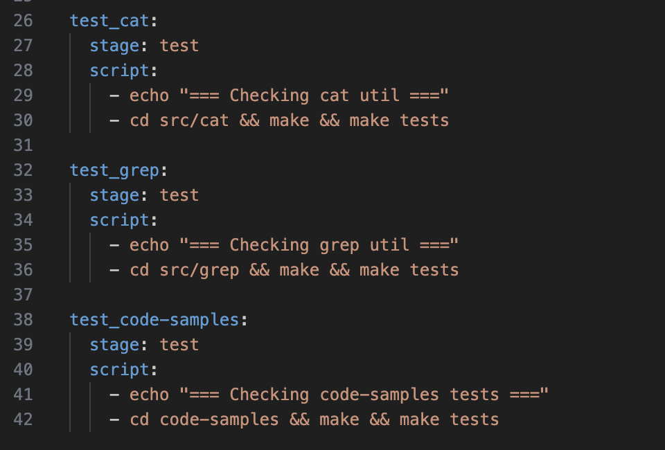

##### Запусти этот этап автоматически только при условии, если сборка и тест кодстайла прошли успешно.
##### Если тесты не прошли, то «зафейли» пайплайн. 
Это гарантируется прописанной последовательностью выполнения стадий в начале нашего  _.gitlab-ci.yml_ файла:

 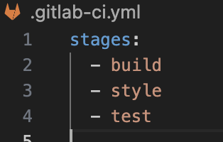

GitLab запускает все job’ы из стадии build. Если они завершились успешно — переходит к следующей стадии (style). Если хотя бы один job в build завершился с ошибкой, то пайплайн останавливается (к style и test GitLab не переходит). Таким образом, test-job’ы выполняются только при успешном завершении всех style-job’ов.

##### В пайплайне отобрази вывод, что интеграционные тесты успешно прошли / провалились.

 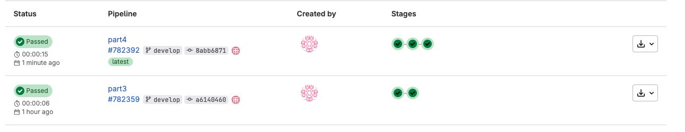

### Part 5. Этап деплоя

**== Задание ==**

##### Подними вторую виртуальную машину *Ubuntu Server 22.04 LTS*.
Теперь у нас есть две виртуальные машины:
- ubuntuserver, которую мы создали и настроили в предыдущих частях этого задания
- ubuntuserver-deploy, кторая выступит в качестве клиента в нашем случае

 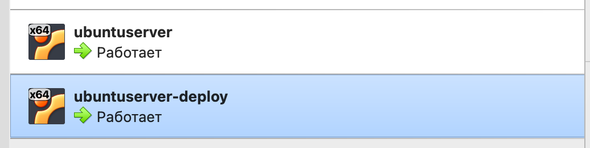

#### Напиши этап для **CD**, который «разворачивает» проект на другой виртуальной машине. Запусти этот этап вручную при условии, что все предыдущие этапы прошли успешно.

Для этого мы добавим новую стадию `deploy` в самый конец, чтобы сохранить необходимую последовательность вызовов, а так же, помимо вызова bash-скрипта, про который мы поговорим далее, нужно прописать условие `when: manual`, которая должна добавить в гитлабе кнопку запуска этого  job’а только в том случае, если предыдущие  job’ы прошли без ошибок. Соответственно, нажав на эту кнопку, мы вручную сможем активировать выполнение последнего  job’а.

 

##### Напиши bash-скрипт, который при помощи **ssh** и **scp** копирует файлы, полученные после сборки (артефакты), в директорию */usr/local/bin* второй виртуальной машины.

Сначала нужно обеспечить связь между двумя виртуальными машинами по SSH. В настройках обеих машин я активировал по 2 сетевых порта. Один используется для связи по ssh (в NAT-адаптере я включил проброс портов по протоколу TCP: для первой машины — порт 2222, для второй — 2223, гостевой порт 22 — стандартный для SSH).

 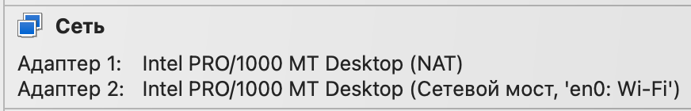

Так же необходимо настроить netplan виртуалок, как мы уже это делали в предыдущих проектах. Для удобства дальнейшей работы с машиной деплоя, лучше прописать для неё статичный ip.

 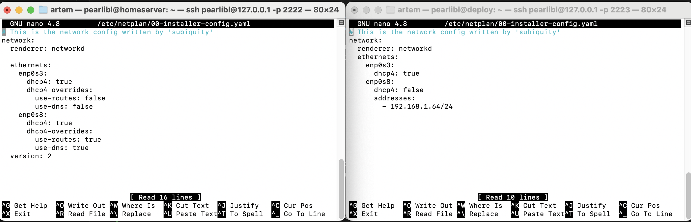

Далее, возвращаемся к первой машине, на которой выполняем команды для генерации ключа (ssh-keygen -t ed25519), а затем преносим его на вторую машину по выделенному ранее ip (ssh-copy-id pearlibl@192.168.1.64), чтобы можно было без пороля подключаться к ней с первой машины. Убедимся, что связь налажена, прописав на первой машине команду ` ssh pearlibl@192.168.1.64`.
Как видим, мы получили удалённый доступ ко второй машине:

 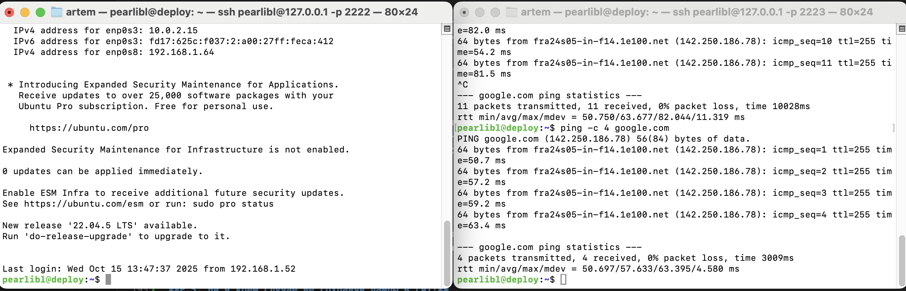

Теперь осталось только написать сам скрипт. Назовём файл `deploy.sh` и добавим его в репозеторий нашего проекта. 
В нем мы сначала прописываем строку `set -e`, встроенную команду Bash, которая говорит интерпретатору, что если любая команда в этом скрипте завершится с ошибкой, то следует немедленно прекратить выполнение всего скрипта. Далее мы копируем наши артефакты в созданную специально для этого папку на машине деплоя. Для этого нам не нужно ничего, кроме простого адреса получателя. Но получить доступ к корневым папкам извне мы не можем, поэтому нам и нужно было настроить ssh канал, по которому мы можем подключиться к машине как sudo пользователь и переместить проект в `"/usr/local/bin"`.(Параметр StrictHostKeyChecking=no отключает проверку подлинности нового хоста, чтобы GitLab Runner не зависал, ожидая подтверждения “yes/no”)

 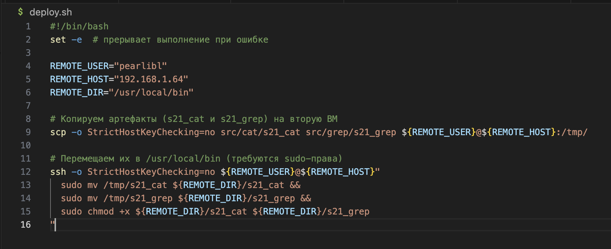

##### В файле _.gitlab-ci.yml_ добавь этап запуска написанного скрипта.##### В случае ошибки «зафейли» пайплайн.
(Сделано выше)

 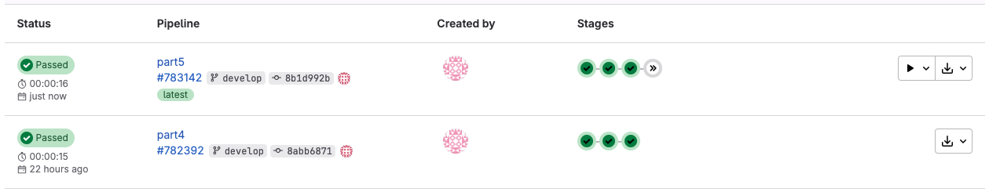

После первого запуска пайплайна я получил ошибку доступа, из-за чего пришлось провести пошаговую отладку и внести изменения в конфигурацию SSH и sudo.

 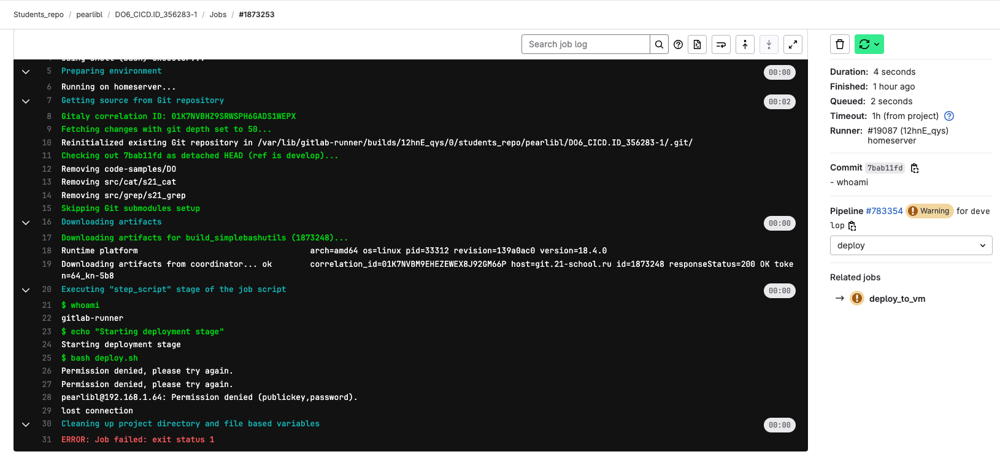

Сначала я подумал, что она возникает из-за неправильной настройки ssh-связи. Поэтому добавил отладочную строку, показывающего пользователя, от имени которого исполняются команды внутри скрипта, создал для этого пользователя директорию для хранения публичного ключа первой машины и скопировал его туда. Так же выяснилось, что скрипт мой тоже требует изменений. Добавим `-i` к нашим командам, чтобы использовать сгенерированный нами ранее ключ. 

 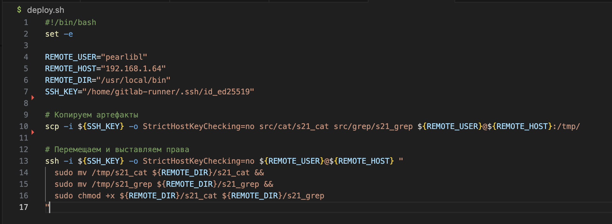

Этапы отладки:

 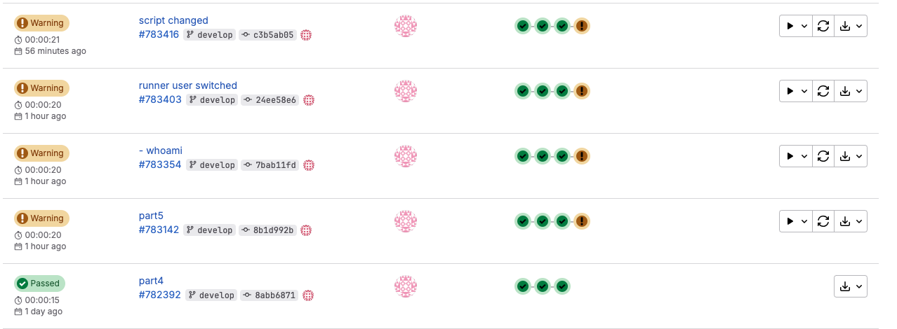

Эти шаги помогли дойти до этапа установки стабильной связи между машинами и gitlab, однако мы столкнулись с новыми трудностями. 
Убедившись, что ключ первой машины уже добавлен в список авторизованных ключей второй машины, а так же в том, что этап копирования прошёл без проблем, я понял, что мы спотыкаемся на этапе вызова команд перемещения от sudo пользователя, поскольку в этот момент требуется ввод пароля для подтверждения операции.

 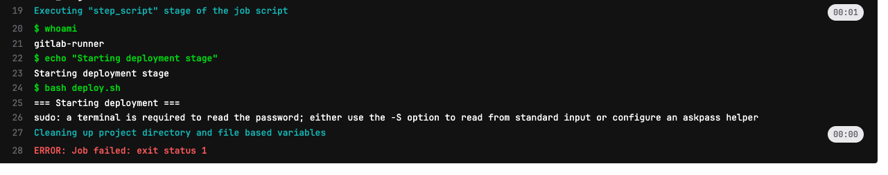

Поэтому мне пришлось сделать исключение для этих команд. В файл /etc/sudoers я добавил правило, позволяющее пользователю pearlibl выполнять команды *mv* и *chmod* без ввода пароля:

 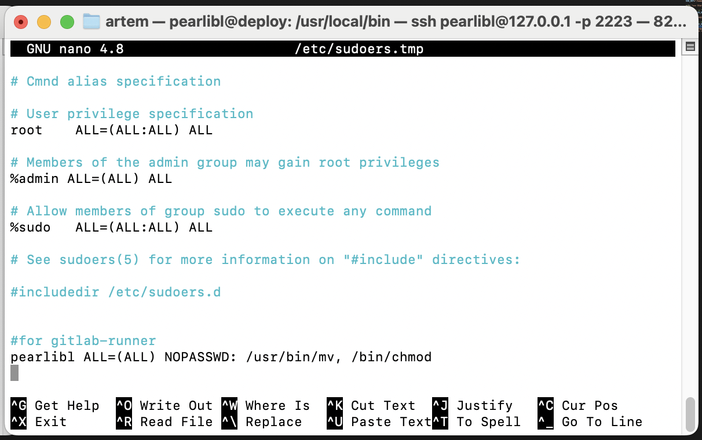

Наконец, мы получили нужный результат:

 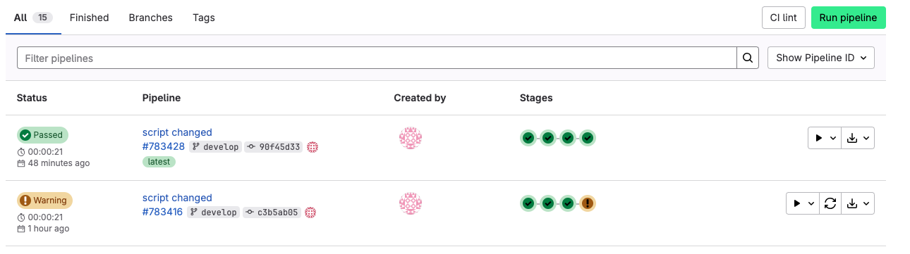

Пайплайн успешно выполняет все стадии — сборку, тестирование и деплой.
При ручном запуске последнего этапа (deploy) артефакты автоматически копируются на удалённую машину и устанавливаются в /usr/local/bin. Проверка запуска программ s21_cat и s21_grep на машине деплоя подтверждает корректную работу CI/CD-конвейера:

 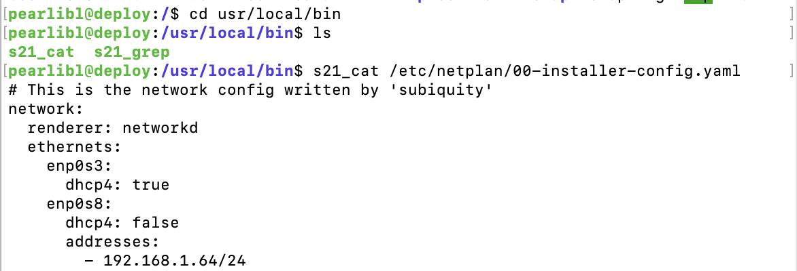

Всё работает! Можем пользоваться!

### Part 6. Дополнительно. Уведомления

**== Задание ==**

#### Настрой уведомления об успешном/неуспешном выполнении пайплайна через бота с именем «[твой nickname] DO6 CI/CD» в *Telegram*.
Для начала я создал собственного Telegram-бота при помощи BotFather. Следуя его инструкциям, получил готового бота и уникальный токен доступа.

 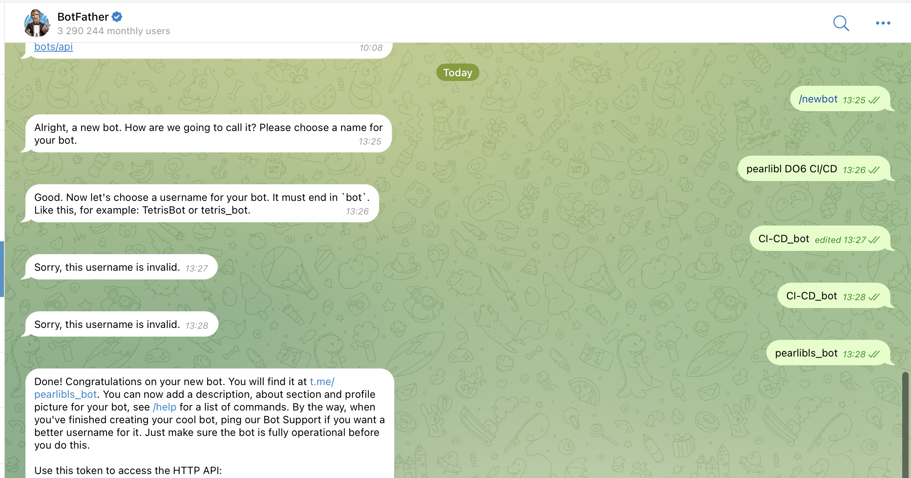

Далее необходимо узнать ID нашего с ботом чата. Для этого я отправил ему тестовое сообщение, после чего в браузере открыл ссылку:
https://api.telegram.org/bot(вместо скобок вставляется токен бота)/getUpdates, после чего получил JSON-ответ с системной информацией, из которого я взял свой ID.

Теперь напишем скрипт `notify.sh`, отправляющий сообщение. По заданию он должен соответствовать следующим пунктам: 
- Текст уведомления должен содержать информацию об успешности прохождения как этапа **CI**, так и этапа **CD**.
- В остальном текст уведомления может быть произвольным.

 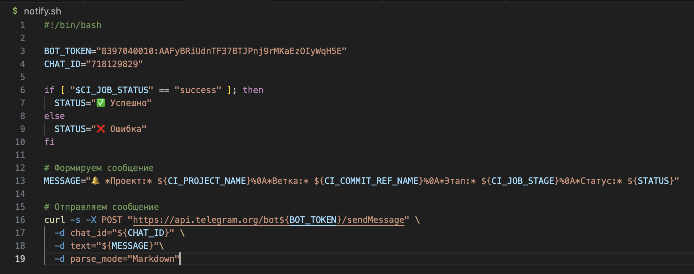

Этот скрипт можно вызывать на любом этапе, добавив в job строку after_script с его именем.

 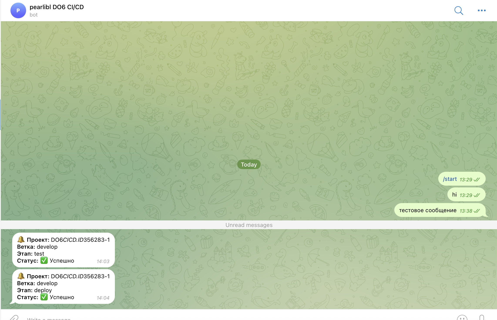

Как и ожидалось, уведомление корректно отображает статус выполнения пайплайна и стадию, из которой оно было вызвано.