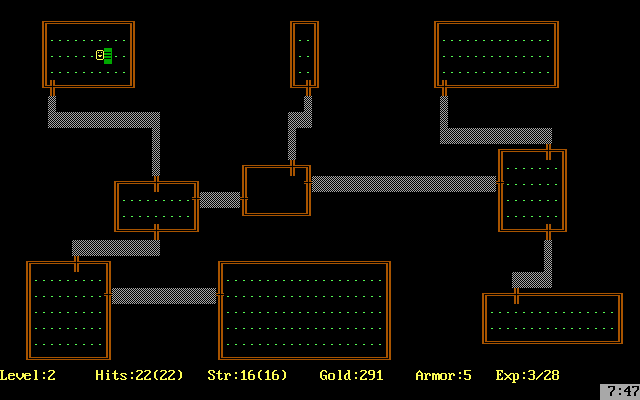
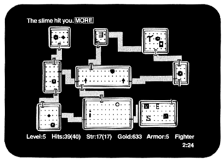

# Project Team 01 — C# Bootcamp

**Summary:** In this project, you will develop a console "roguelike" game application in the C# programming language using the curses library (the dotnet-curses version for C#) in the spirit of the classic 1980 game **Rogue**.

💡 [Click here](https://new.oprosso.net/p/4cb31ec3f47a4596bc758ea1861fb624) to share feedback on this project. It is anonymous and will help our team improve the training. We recommend filling out the survey immediately after completing the project.

## Contents
 1. [Chapter I — Instruction](#chapter-i--instruction)
 2. [Chapter II — General Information](#chapter-ii--general-information)
     - [Rogue 1980](#rogue-1980)
     - [Application architecture](#application-architecture)
 3. [Chapter III](#chapter-iii)
     - [Task 0. How did we get here?](#task-0-how-did-we-get-here)
     - [Task 1. Essential game entities](#task-1-essential-game-entities)
     - [Task 2. Energetic gameplay](#task-2-energetic-gameplay)
     - [Task 3. Generated world](#task-3-generated-world)
     - [Task 4. Cozy 2D](#task-4-cozy-2d)
     - [Task 5. Cartridge with a battery](#task-5-cartridge-with-a-battery)
     - [Task 6. (Optional) You shall not pass!](#task-6-optional-you-shall-not-pass)
     - [Task 7. (Optional) The art of balance](#task-7-optional-the-art-of-balance)
     - [Task 8. (Optional) Imagine you are a table](#task-8-optional-imagine-you-are-a-table)
     - [Task 9. (Optional) Full 3D](#task-9-optional-full-3d)

## Chapter I — Instruction

**Instructions**

1. Throughout the course, you will experience uncertainty and a severe lack of information — this is normal. Remember that the repository and Google are always available to you, as are your peers and Rocket.Chat. Communicate. Search. Rely on common sense. Do not be afraid of making mistakes.
1. Pay attention to sources of information. Verify, think, analyze, compare.
1. Read the assignments carefully. Reread them several times.
1. It’s best to read the examples carefully as well. They may contain something not explicitly stated in the assignment itself.
1. You might encounter inconsistencies when something new in the task or example contradicts what you already know. If that happens, try to figure it out. If you fail, make a note under “open questions” and resolve it during your work. Do not leave open questions unresolved.
1. If a task seems unclear or unachievable, it only seems that way. Try decomposing it. Most likely, individual parts will become clearer.
1. Along the way, you’ll encounter many different tasks. Those marked with an asterisk (\*) are for more meticulous learners. They are of higher complexity and are not mandatory, but if you do them, you’ll gain additional experience and knowledge.
1. Do not try to fool the system or those around you. You’ll only be fooling yourself.
1. Have a question? Ask the neighbor on your right. If that doesn’t help, ask the neighbor on your left.
1. When using someone’s help, always make sure you understand why, how, and what for. Otherwise, that help is meaningless.
1. Always push only to the **develop** branch! The **master** branch will be ignored. Work in the **src** directory.
1. Your directory should not contain any files other than those specified in the tasks.

## Chapter II — General Information
### Rogue 1980

**Rogue**, meaning "rogue" or "scoundrel," is a computer game developed by Epyx in 1980. Its main theme is dungeon exploration. It was extremely popular on university Unix systems in the early 1980s and spawned an entire genre of games known as **roguelike**.

In *Rogue*, the player assumes the role of an adventurer in an early fantasy role-playing game. The game begins at the top level of an unmapped dungeon containing monsters and treasures. As the player progresses deeper into the randomly generated dungeon, the monsters grow stronger, making advancement more difficult.

Each dungeon level consists of a 3×3 grid of rooms, except for dead-end corridors where one would expect a room. Later variants also included "mazes," which are winding corridors with dead ends, alongside the rooms. Unlike most adventure games of that time, the dungeon layout and placement of objects were randomly generated. Thus, each playthrough was unique and equally risky for beginners and experienced players alike.

The player has **three attributes**: health, physical strength, and experience. All three attributes can be increased using various potions and scrolls or decreased by stepping on a trap or reading a cursed scroll. The wide selection of magic potions, scrolls, wands, weapons, armor, and food leads to varied gameplay and multiple ways to win or lose.

### Application architecture
When implementing application projects involving data, business logic, and a user interface, a multi-layer architecture is typically employed. A classic standard separation can be represented as follows:

- **Presentation layer** (View/UI layer);
- **Business logic layer** (Domain layer);
- **Data access layer** (Data Source layer).

Splitting the logic into business and presentation layers organizes application logic more clearly and separates components with varying stability.

For instance, the presentation layer should contain code that handles what is displayed on the user's screen and processes user input. In other words, this layer manages interaction with dotnet-curses library components and the domain level.

The domain layer should contain the application's business logic, which is not tied to any frameworks. In this project, this includes defining the logic of game-related entities, such as the game itself, the player, the enemy, the levels, the map, and so on, as well as the gameplay logic. For instance, the player's position and the logic for changing the player's numeric attributes on the map should be handled in the domain layer and then passed to the presentation layer for display. According to the concept of Clean Architecture, the business logic layer must not depend on the other layers. To achieve this, use the dependency inversion principle.

To conveniently organize the interaction between layers, you can also use the **MVC** family of patterns (**MVP**, **MVVM**, **MVPVM**, etc.). In these patterns, the logic layers (**Model**) are connected with the presentation layers (**View**) by special "binding" service layers (**Controller**, **Presenter**, **ViewModel**, etc.). Different programming languages and frameworks have their own preferred ways to formalize and link these layers, but the principle is often similar.

The **datalayer** in the application should be responsible for working with data. In this project, for example, it stores the history of past games.

## Chapter III

### Task 0. How did we get here?

**Game application:**

- should be implemented in C# version 12;
- should have a console interface based on the dotnet-curses library;
- should be controlled via the keyboard;
- should have a well-thought-out, clean architecture with clear layer separation;
- should implement the logic of the classic 1980 Rogue game with some simplifications. Specific requirements for the game mechanics are described in the following sections;
- if some details of the game process are not covered by this text, it is acceptable to rely on the logic of the original 1980 game mechanics.

### Task 1. Essential game entities

The game should support the layer separation described in the **Application architecture** section. It should have the following layers: domain and gameplay, rendering, and data handling.

Begin development by implementing the domain layer, which describes the main game entities.

The **main recommended entities with basic attributes** are listed below (this is a necessary but not exhaustive list):

- **Game session**;
- **Level**;
- **Room**;
- **Corridor**;
- **Character:** 
  + Maximum health,
  + Health,
  + Agility,
  + Strength;
- **Backpack**;
- **Enemy:** 
  + Type,
  + Health,
  + Agility,
  + Strength,
  + Hostility;
- **Item:** 
  + Type,
  + Subtype,
  + Health (amount of increase for food),
  + Maximum health (amount of increase for scrolls and elixirs),
  + Agility (amount of increase for scrolls and elixirs),
  + Strength (amount of increase for scrolls, elixirs, and weapons),
  + Value (for treasures).

### Task 2. Energetic gameplay

Implement the game's **gameplay** in the domain layer, independent of the **presentation** and **datalayer**.

#### *Game Logic*
- The game should contain **21 levels** of dungeon.
- Each dungeon level should consist of **9 rooms** connected by corridors.
- Each room can contain enemies and items.
- The player controls the movement of the character, can interact with items, and fight with enemies.
- The goal of the player is to find on each level the passage to the next level and thus complete all 21 levels.
- On each level, the player starts in a random position in the **starting room**, which is guaranteed to have no enemies. 
- After the main character dies, the game resets and everything returns to the beginning.
- With each new level, the number and difficulty of enemies increases, the number of useful items decreases, and the amount of treasure increases.
- After every playthrough (whether successful or not), the player's result is recorded in a high score table, indicating the dungeon level reached and the number of treasures collected. The high score table should be sorted by the number of treasures.
- The entire game should operate in **turn-based mode** (each player action triggers enemy actions).

#### *Character Logic*
- The character’s **health** attribute represents their current health, and when the character’s health reaches 0, the game ends.
- The **maximum health** attribute represents the character’s max health, which can be restored by consuming food.
- The **agility** attribute should be involved in the formula for calculating the hit probability of enemies against the character and the character against enemies, and also influence movement speed through the dungeon.
- The **strength** attribute should determine the base damage dealt by the character without a weapon, and also be involved in the damage calculation formula when using a weapon.
- For defeating an enemy, the character gains an amount of treasure that depends on the difficulty of the enemy.
- The character can pick up items and store them in their backpack, and then use them.
- Each item can temporarily or permanently alter one of the character’s attributes when used.
- Upon reaching the exit of a level, the character automatically proceeds to the next level.

#### *Enemy Logic*
- Each enemy has attributes analogous to the player’s: health, agility, speed, and strength, and in addition has a **hostility** attribute.
- The hostility attribute determines the distance from which an enemy begins to chase the player.
- There are **5 types of enemies**: 
  - **Zombie** (displayed as a green z): Low agility. Medium strength and hostility. High health.
  - **Vampire** (displayed as a red v): High agility, hostility, and health. Medium strength. Steals some of the player’s maximum health on a successful attack. The first hit on a vampire always misses.
  - **Ghost** (displayed as a white g): High agility. Low strength, hostility, and health. Constantly teleports around the room and periodically becomes invisible until the player engages in combat.
  - **Ogre** (displayed as a yellow O): Moves around the room two tiles at a time. Very high strength and health, but after each attack rests for one turn, then will guaranteed counterattack. Low agility. Medium hostility.
  - **Snake-mage** (displayed as a white s): Very high agility. Moves diagonally across the map, constantly changing direction. Each successful attack has a chance to "put the player to sleep" for one turn. High hostility.
- Each type of enemy has its own movement pattern within a room.

#### *Environment Logic*
- Each item type has its own purpose or effect: 
  - **Treasures** — have value, accumulate over the game, and affect the final score.
  - **Food** — restores health by a certain amount.
  - **Elixirs** — temporarily increase one of the attributes (agility, strength, or max health).
  - **Scrolls** — permanently increase one of the attributes (agility, strength, or max health).
  - **Weapons** — have a strength attribute; using a weapon changes the damage calculation formula.
- When a character steps on an item, it should automatically be added to their backpack if there is room (the backpack can hold a maximum of nine items of each type).
- Food, elixirs, and scrolls are consumed upon use.
- When switching weapons, the currently equipped weapon should drop to the floor on an adjacent tile.
- Each dungeon level has content depending on its **index** (depth): 
  - The deeper the level, the more difficult it is.
  - A level consists of rooms.
  - Rooms are connected by corridors.
  - Rooms contain enemies and items.
  - Enemies and the player can move through rooms and corridors.
  - Each level has a guaranteed exit to the next level.
  - Exiting the last level ends the game.

#### *Combat Logic*
- Combat is resolved in a turn-based manner.
- An attack is performed by moving the character toward an enemy.
- Combat is initiated upon contact with an enemy.
- Attacks are calculated sequentially, in several stages: 
  - **Stage 1 — Hit check:** The chance to hit is random and calculated based on the attacker's and target's agility and speed.
  - **Stage 2 — Damage calculation:** Damage is determined by the attacker's strength and any modifiers (e.g., weapon).
  - **Stage 3 — Apply damage:** The calculated damage is subtracted from the target’s health. If the target's health drops to 0 or below, the enemy or character dies.
- Each defeated enemy drops a random amount of treasure depending on its hostility, strength, agility, and health.

### Task 3. Generated world
Implement a module for **level generation** in the domain layer.

- Each level should be logically divided into 9 sections, each of which randomly generates a room of arbitrary size and position.
- Rooms are randomly connected by corridors. Corridors have their own geometry and are traversable; therefore, their coordinates must be generated and stored. During generation, ensure that the generated graph of rooms is connected and error-free.
- On each level, one room is marked as the starting room and another as the ending room. The game session begins in the starting room. In the ending room, there is an object that transports the player to the next level when touched.
- *(A sample implementation of level generation is provided in the code-samples folder.)*

### Task 4. Cozy 2D
Implement the game rendering with **dotnet-curses** in the presentation layer, using the necessary domain entities.

#### *Display*
- **Environment rendering** — draw walls, floor, doorways in walls, and corridors between rooms.
- **Actor rendering** — draw the character, enemies, and collectible items.
- **Interface rendering** — display the game interface (status panel, inventory, simple menu).
- **Fog of war** — the scene rendering depends on the game state: 
  - Unexplored rooms and corridors are not displayed at all.
  - Rooms that have been seen but which the player is not currently in are shown only as their walls (contents hidden).
  - Rooms where the player is present display walls, floor, actors, and items.
  - When the player is adjacent to a room from a corridor, the fog of war only lifts in the line of sight (the Ray Casting and Bresenham algorithms determine the visible area).
- *(A sample implementation of level rendering is provided in the code-samples folder.)*

#### *Controls*
**Character control:**

- Movement using the **WASD** keys.
- Use a weapon from the backpack with the **H** key.
- Use a medkit from the backpack with the **J** key.
- Use an elixir from the backpack with the **K** key.
- Use a scroll from the backpack with the **E** key.
- Using any item from the backpack should result in a list of that type of item appearing on the screen, along with a prompt asking the player to select one (1–9).

#### *Statistics*
The game collects and displays statistics of all playthroughs in a separate view. These statistics are sorted by the number of treasures collected. These statistics should include the following:
- Number of treasures collected;
- Highest level reached;
- Number of enemies defeated;
- Amount of food eaten;
- Number of elixirs drunk;
- Number of scrolls read;
- Number of hits dealt and taken;
- Number of tiles traversed.

### Task 5. Cartridge with a battery
Implement the **datalayer** where the player's game progress data is saved to and loaded from a ``JSON`` file.

- After completing each level, the obtained statistics and the number of the level completed should be saved.
- After restarting the game, levels should be generated according to the saved information, and the player’s progress fully restored (score, current attribute values).
- This file should also save statistics from all playthrough attempts.

### Task 6. (Optional) You shall not pass!
- Generate doors between rooms and corridors, as well as keys for them. Implement a system of colored keys similar to the classic *DOOM*.
- In solving this task, use modified depth-first or breadth-first search algorithms to verify key accessibility and validate generation to prevent **softlocks** (i.e., unwinnable situations).

### Task 7. (Optional) The art of balance
- Add a system of automatic difficulty adjustment based on the player’s performance. If the player is breezing through levels easily, the difficulty should increase. If the player is struggling, introduce more helpful items (for example, provide more medkits if the player often runs low on health) and reduce the number and difficulty of enemies.

### Task 8. (Optional) Imagine you are a table
- Add a new enemy **Mimic** (displayed as a white m), which imitates items. It has high agility, low strength, high health, and low hostility.

### Task 9. (Optional) Full 3D
- Add a 3D rendering mode to the game, in which: 
  - The main view switches to a first-person 3D perspective.
  - The 2D view remains as a mini-map in a corner of the screen.
  - Controls change accordingly: **W** — move forward, **S** — move backward, **A** — turn left, **D** — turn right.
- Use a Ray Casting algorithm and the dotnet-curses library to render rooms and corridors in 3D.
- The walls of rooms and tunnels should have a texture so that the player’s movement is visually noticeable.
- *(A sample implementation of 3D rendering is provided in the code-samples folder.)*
